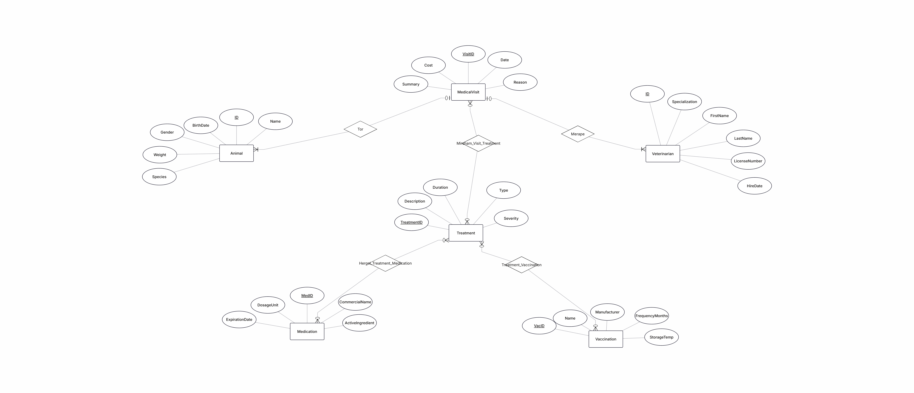

# 🐾 Minip_DB_5786_6659_5932

This project is the **Veterinary and Health Management Department** module of a larger Zoo Management Database System.

---

## 🚀 Quick Start

To run the application using Docker Compose:

```bash
# Start the database and build containers in detached mode
docker-compose up -d --build

# Stop the containers and remove volumes
docker-compose down -v
```

---


## 🏗️ Phase 1: Veterinary Information System (Zoo Management)

### 1. System Overview & Boundaries

This system is strictly bounded to the medical administration of the zoo. It manages the entities directly involved in veterinary care.

#### 🎯 In Scope
- **Core Entities:** Animals (patients) and Veterinarians (staff).
- **Clinical Entities:** Medical Visits, Treatments, Medications, and Vaccinations.

#### 🚫 Out of Scope
This module does **not** handle:
- Zoo ticketing
- Visitor management
- Animal habitat assignments
- Daily dietary feeding 
*(These belong to other theoretical modules in the overarching Zoo ERP)*

#### 📐 Architecture
The architecture follows standard relational design principles (**BCNF/3NF**). It utilizes junction tables (e.g., `Mirsham_Visit_Treatment`, `Hergel_Treatment_Medication`) to resolve many-to-many relationships between medical visits, treatments, and prescriptions.

#### 📊 Database Design
> 🖼️  \
> 🖼️ *[screenshot: Data Structure Diagram generated from pgAdmin after executing the schema]*

---

### 2. Data Population Process

To ensure a robust testing environment, the database was populated with realistic mock data using three distinct methods. This meets the requirement of generating at least **500 records** for central tables (e.g., the `Animal` table). Random `NULL` values were injected into optional fields (like `Weight` and `Summary`) to simulate real-world data imperfections.

#### 💻 Method 1: Database Scripting / Code Generation
We utilized advanced SQL scripting, specifically PostgreSQL's `generate_series()` function combined with `ARRAY` and `random()` logic, to programmatically generate large-scale datasets. This was used to create:
- 500 unique animal profiles
- 200 medical visits with randomized dates and attributes

> 🖼️ *[screenshot: View of the SQL script executing the generate_series code in pgAdmin Query Tool]* \
> 🖼️ *[screenshot: The resulting 500 rows inside the Animal table (Data Output view)]*

#### 🧩 Method 2: External Data Generators (Mockaroo)
For specialized textual data that requires realistic formatting (e.g., Veterinarian names, License Numbers, and specialized roles), external mock data tools were utilized to generate the base structures. This ensures high-fidelity test data for names and professional credentials.

> 🖼️ *[screenshot: Generating or formatting the data on an external tool like Mockaroo / generatedata]* \
> 🖼️ *[screenshot: The imported results showing Veterinarian profiles in the database]*

#### 📄 Method 3: CSV / Excel File Import
Static lookup tables and specific clinical data (such as the Medication and Vaccination catalogs) were structured in tabular spreadsheet formats (Excel/CSV). These were then ingested directly into the database using **pgAdmin's native Import/Export utility**, ensuring accurate mapping of columns like `ActiveIngredient` and `ExpirationDate`.

> 🖼️ *[screenshot: The pgAdmin Import/Export dialog box showing the CSV file mapping]* \
> 🖼️ *[screenshot: The successfully populated Medication/Vaccination table in pgAdmin]*

---

### 3. Database Backup and Restoration

To guarantee data integrity and allow for a complete system rebuild from scratch, a **full logical backup** of the database was performed.

#### 💾 Backup Approach
The backup was created using pgAdmin's native Backup tool. The database was exported as a `.sql` file (Plain format) or `.tar` (Custom format). 

**Why this method?**
It encapsulates both the **DDL** (Data Definition Language - the table schemas) and the **DML** (Data Manipulation Language - the 500+ inserted records) in a single restorable file.

#### 🔄 Restoration
If the database drops, the entire environment—including relationships, constraints, and mock data—can be **fully restored** using the pgAdmin Restore function targeting this single backup file.

> 🖼️ *[screenshot: The pgAdmin Backup dialog box configured with the selected options]* \
> 🖼️ *[screenshot: The "Backup Completed Successfully" notification in pgAdmin]*