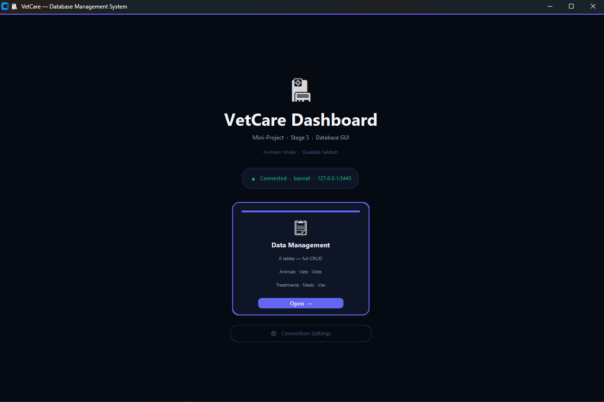

# 🐾 Minip_DB_5786_6659_5932

## Veterinary & Health Management Department — Zoo Management Database

> **Team:** Avinoam Muller (347465932) • Guedalia Sebbah (337966659)  
> **Database:** PostgreSQL 17.1 (Docker)  
> **GUI:** Python + CustomTkinter  

---

## 📖 Project Overview

This project implements a comprehensive **veterinary clinic management system** integrated with an **HR management module** for a zoo organization. The database manages animals, veterinarians, medical visits, treatments, medications, vaccinations, employees, departments, shifts, and their complex relationships.

The project was built incrementally over 5 stages, culminating in a full **desktop GUI application** that provides CRUD operations, advanced reporting, and PL/pgSQL procedure execution — all in a modern dark-mode interface.

---

## 🏗️ Project Stages

### 📋 Shlav 1 — Database Design & Population
Design and creation of the core schema (6 tables + 3 junction tables in 3NF), data population via Mockaroo and manual insertion.

👉 [View the full Shlav 1 README](Shlav1/README_SHLAV1.md)

### 📋 Shlav 2 — Advanced Queries
8 SELECT queries (4 "double" with efficiency analysis + 4 simple), 3 DELETE queries, and 3 UPDATE queries demonstrating subqueries, CTEs, window functions, and DML operations.

👉 [View the full Shlav 2 README](Shlav2/README_SHLAV2.md)

### 📋 Shlav 3 — Database Integration
Integration of the VetCare system with an external HR system (Eitan's department). Added Employee, Department, Role, Office, Shift, and Shift_Assignment tables. Connected veterinarians to employees via a foreign key link.

👉 [View the full Shlav 3 README](Shlav3/README_SHLAV3.md)

### 📋 Shlav 4 — PL/pgSQL Programs
8 advanced PL/pgSQL programs: 2 functions (animal medical summary, vet visits report), 2 procedures (visit transfer, expired medication cleanup), 2 triggers (audit log, animal stats update), and 2 main programs. Schema modifications added `status`, `last_updated`, `total_visits`, `last_visit_date` columns and `audit_log`, `expired_medications_archive` tables.

👉 [View the full Shlav 4 README](Shlav4/README_SHLAV4.md)

### 📋 Shlav 5 — GUI Application ⭐
Full desktop GUI built with **Python + CustomTkinter + psycopg2**:
- **6 CRUD tabs** (Animal, Veterinarian, MedicalVisit, Treatment, Medication, Vaccination)
- **Foreign keys hidden** — meaningful names shown via SQL JOINs
- **Update-by-PK flow** — fetch record before editing
- **Advanced Reports** — Stage 2 queries + Stage 4 PL/pgSQL execution

👉 [View the full Shlav 5 README](Shlav5/README_SHLAV5.md)


*Welcome screen — DB connection status indicator + navigation buttons*

> 📸 See [Shlav5/README_SHLAV5.md](Shlav5/README_SHLAV5.md) for the full gallery of screenshots (CRUD tabs, FK resolution, Advanced Reports, function/procedure execution).

---

## 🗄️ Database Schema (16 Tables)

### Core VetCare System
| Table | Description |
|-------|-------------|
| `Animal` | Zoo animals with species, gender, weight, birth date |
| `Veterinarian` | Clinic vets with license, specialization, employee link |
| `MedicalVisit` | Visit records linking animals to vets with cost/status |
| `Treatment` | Treatment catalog with severity levels |
| `Medication` | Medication inventory with expiration tracking |
| `Vaccination` | Vaccine catalog with frequency and storage |
| `Mirsham_Visit_Treatment` | M:M — visits ↔ treatments |
| `Hergel_Treatment_Medication` | M:M — treatments ↔ medications |
| `Treatment_Vaccination` | M:M — treatments ↔ vaccinations |

### Integrated HR System
| Table | Description |
|-------|-------------|
| `Employee` | Organization employees (linked to vets) |
| `Department` | Organizational departments |
| `Role` | Employee roles/positions |
| `Employee_Contract` | Salary and contract details |
| `Office` | Physical office locations |
| `Shift` | Shift definitions (Morning/Evening/Night) |
| `Shift_Assignment` | M:M — employees ↔ shifts per date |

### Stage 4 Support Tables
| Table | Description |
|-------|-------------|
| `audit_log` | Automatic change tracking (populated by triggers) |
| `expired_medications_archive` | Archived medications from cleanup procedure |

---


## 🚀 Quick Start

### 1. Start the Database (Docker)

```bash
# Start PostgreSQL and pgAdmin containers
docker-compose up -d --build

# Stop and remove data
docker-compose down -v
```

### 2. Run the GUI Application

```bash
cd Shlav5
pip install -r requirements.txt
python app.py
```

### 3. Access pgAdmin (Web)

- URL: `http://localhost:8080`
- Email: `guedalia.sebbah@gmail.com`
- Password: see `.env`

---

## 🔄 Database Restoration (Stage 3 Baseline)

To reset the database to the Stage 3 baseline before running Stage 4 scripts:

1. **Clean the database** (Run in pgAdmin Query Tool):
   ```sql
   DROP SCHEMA public CASCADE;
   CREATE SCHEMA public;
   ```

2. **Restore from backup** (Run in host terminal):
   ```bash
   cmd /c "type .\Shlav3\backup3.backup | docker exec -i PostgreSQL_DB psql -U admin -d basnat"
   ```

---

## 🏷️ Git Tags

```bash
git tag shlav5
git push origin shlav5
```

---

## 🧰 Tech Stack Summary

| Layer | Technology |
|-------|-----------|
| Database | PostgreSQL 17.1 |
| Containerization | Docker + Docker Compose |
| DB Admin | pgAdmin 4 (Web) |
| GUI | Python 3.10+ / CustomTkinter |
| DB Connector | psycopg2 |
| Version Control | Git + GitHub |