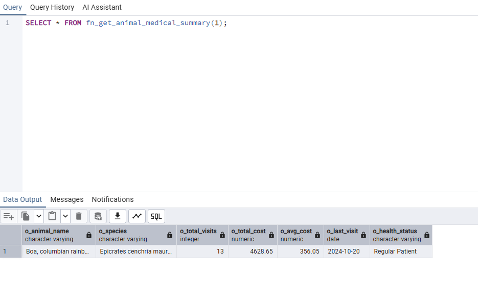
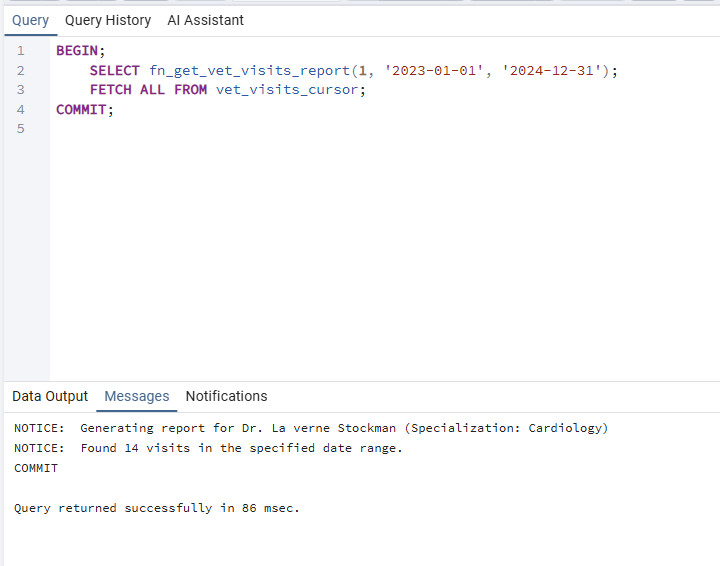
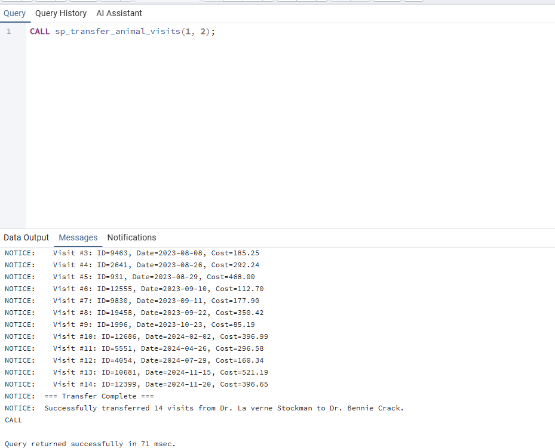
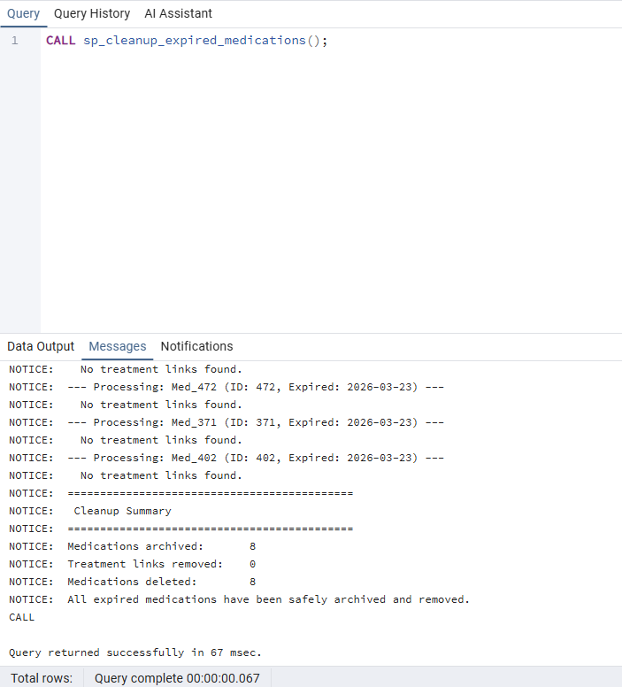
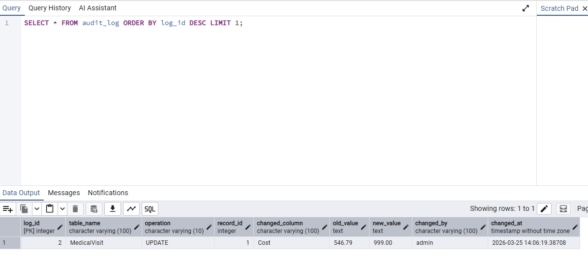
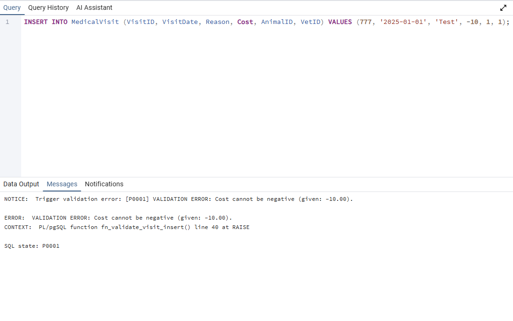
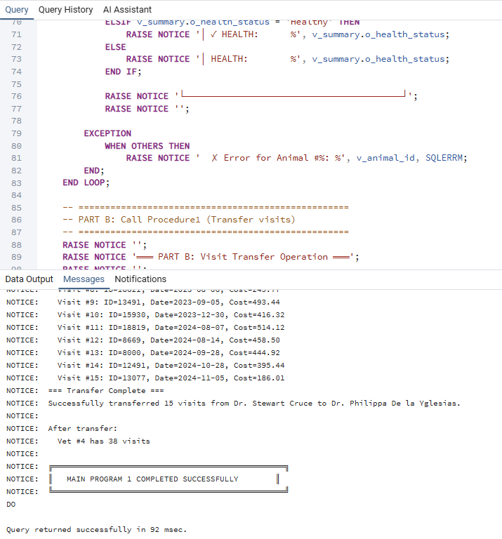
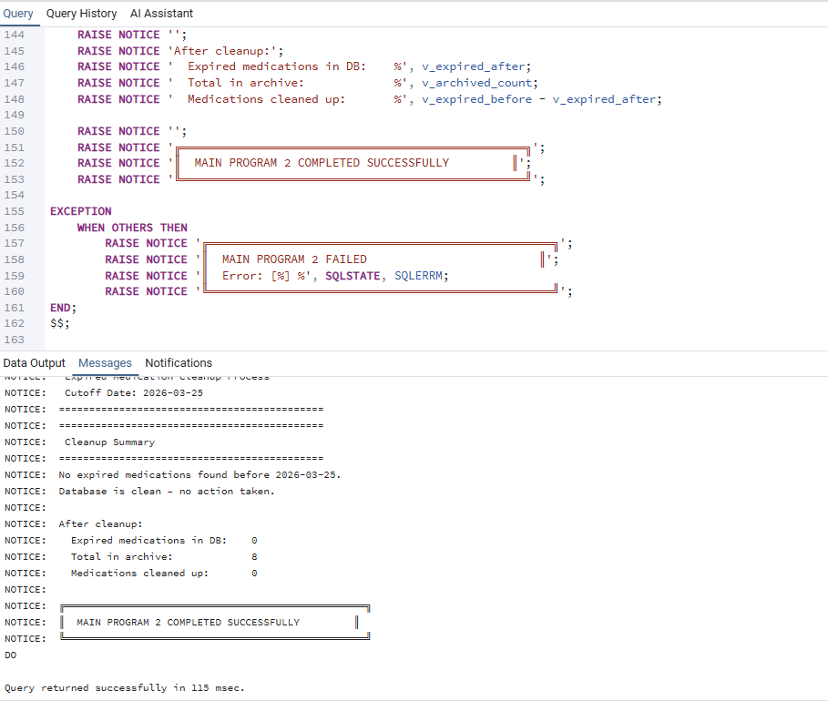
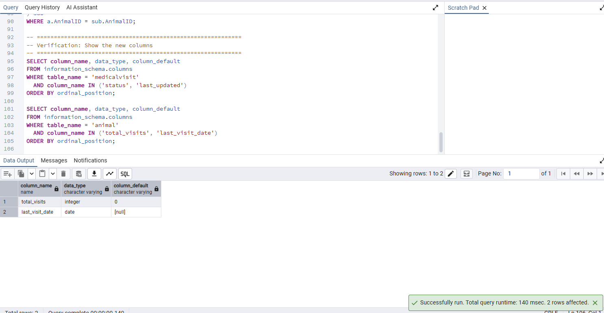

# 🛡️ Phase 4: Advanced PL/pgSQL Programming — VetCare System

**Team Members:** Avinoam Muller 347465932, Guedalia Sebbah 337966659

---

## 📌 Overview
This stage focuses on implementing advanced server-side logic using PL/pgSQL. We have developed 8 non-trivial programs (Functions, Procedures, Triggers, and Main Blocks) that automate complex business rules, maintain data integrity, and provide detailed reporting for the integrated VetCare and HR system.

---

## 🛠️ 1. Functions

### 1.1 `fn_get_animal_medical_summary`
**Description:** 
This function generates a comprehensive medical health profile for an animal. Using an **explicit cursor**, it iterates through all visits, calculates total and average costs, identifies the most recent visit date, and analyzes the visit frequency to assign a "Health Status" label (e.g., 'Healthy', 'Frequent Visitor', or 'Critical'). It includes robust **exception handling** for non-existent animal IDs.

#### 📝 Code:
```sql
-- [Refer to Shalv4/Function1.sql for full implementation]
SELECT * FROM fn_get_animal_medical_summary(p_animal_id);
```

> 📸 **Screenshot: Animal Medical Summary Result**
> 🖼️ 
> *Caption: Successful execution showing composite medical profile and health status*

---

### 1.2 `fn_get_vet_visits_report`
**Description:** 
Provides a high-level reporting tool that returns a **REF CURSOR**. It takes a Veterinarian ID and a date range, validates the inputs, and opens a cursor containing detailed visit information (animal names, costs, treatment counts). This allows calling programs to process large reports row-by-row efficiently.

#### 📝 Code:
```sql
-- [Refer to Shalv4/Function2.sql for full implementation]
SELECT fn_get_vet_visits_report(p_vet_id, p_start, p_end);
```

> 📸 **Screenshot: Vet Report Ref Cursor Fetch**
> 🖼️ 
> *Caption: Proof of fetching data from the returned Ref Cursor*

---

## ⚙️ 2. Procedures

### 2.1 `sp_transfer_animal_visits`
**Description:** 
Automates the transfer of an entire patient list from one veterinarian to another (e.g., during staff turnover). It uses an **implicit cursor** to perform a bulk update, captures the row count using `GET DIAGNOSTICS`, and logs the entire transfer event into the audit system.

#### 📝 Code:
```sql
-- [Refer to Shalv4/Procedure1.sql for full implementation]
CALL sp_transfer_animal_visits(from_vet, to_vet);
```

> 📸 **Screenshot: Visit Transfer Logs**
> 🖼️ 
> *Caption: Execution output showing the list of transferred visits and the final row count*

---

### 2.2 `sp_cleanup_expired_medications`
**Description:** 
A data hygiene procedure that uses an **explicit cursor with a WHILE loop** to identify medications past their expiration date. It safely archives the data into an archive table, removes junction table links, and deletes the expired record from the main inventory.

#### 📝 Code:
```sql
-- [Refer to Shalv4/Procedure2.sql for full implementation]
CALL sp_cleanup_expired_medications(cutoff_date);
```

> 📸 **Screenshot: Medication Cleanup Summary**
> 🖼️ 
> *Caption: Procedure summary showing archived meds and removed treatment links*

---

## ⚡ 3. Triggers

### 3.1 `trg_audit_visit_update` (AFTER UPDATE)
**Description:** 
A non-intrusive monitoring trigger that fires after any update to a `MedicalVisit`. It compares `OLD` and `NEW` records to detect changes in critical columns (VetID, Cost, Status) and automatically records them in the `audit_log` table for security and history tracking.

#### 📝 Code:
```sql
-- [Refer to Shalv4/Trigger1.sql for full implementation]
CREATE TRIGGER trg_audit_visit_update AFTER UPDATE ON MedicalVisit ...
```

> 📸 **Screenshot: Audit Log Verification**
> 🖼️ 
> *Caption: result of SELECT * FROM audit_log showing the trigger-generated record after an update*

---

### 3.2 `trg_validate_visit_insert` (BEFORE INSERT)
**Description:** 
Enforces complex business rules before saving a visit. It validates that IDs exist, prevents negative costs or future dates, and automatically updates the animal's denormalized visitation counters.

#### 📝 Code:
```sql
-- [Refer to Shalv4/Trigger2.sql for full implementation]
CREATE TRIGGER trg_validate_visit_insert BEFORE INSERT ON MedicalVisit ...
```

> 📸 **Screenshot: Validation Exception Catch**
> 🖼️ 
> *Caption: Proof of the trigger blocking an invalid insert with a custom error message*

---

## 🚀 4. Main Programs (Integration)

### 4.1 Main Program 1: Medical History & Staff Management
**Description:** 
A `DO` block that iterates through an array of animal IDs to print health reports (calling Function 1) and then executes a veterinarian patient transfer (calling Procedure 1). It demonstrates the seamless integration of functions and procedures in a single transaction.

#### 📝 Code:
```sql
-- [Refer to Shalv4/MainProgram1.sql for full implementation]
DO $$ ... $$;
```

> 📸 **Screenshot: Main Program 1 Formatted Output**
> 🖼️ 
> *Caption: Formatted console output showing animal summaries and transfer results*

---

### 4.2 Main Program 2: Billing & Inventory Maintenance
**Description:** 
This `DO` block calls Function 2 to process a Ref Cursor for billing data (calculating running totals) and then invokes the medication cleanup procedure to ensure only valid medications are available in the system.

#### 📝 Code:
```sql
-- [Refer to Shalv4/MainProgram2.sql for full implementation]
DO $$ ... $$;
```

> 📸 **Screenshot: Main Program 2 Report & Cleanup**
> 🖼️ 
> *Caption: Console output showing the billing report table and cleanup stats*

---

## 📊 Appendix: Schema Modifications

### `AlterTable.sql`
**Description:** 
Creates the supporting infrastructure for Stage 4, including audit logs, archive tables, and denormalized columns (`total_visits`, `last_visit_date`) to improve performance.

> 📸 **Screenshot: Database Structure Update**
> 🖼️ 
> *Caption: Proof of successfully adding the new columns and tables*
