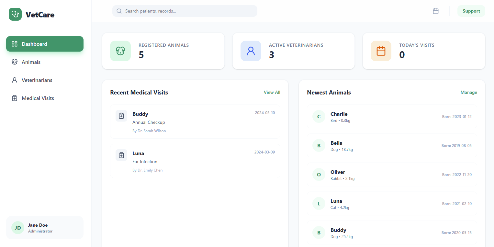
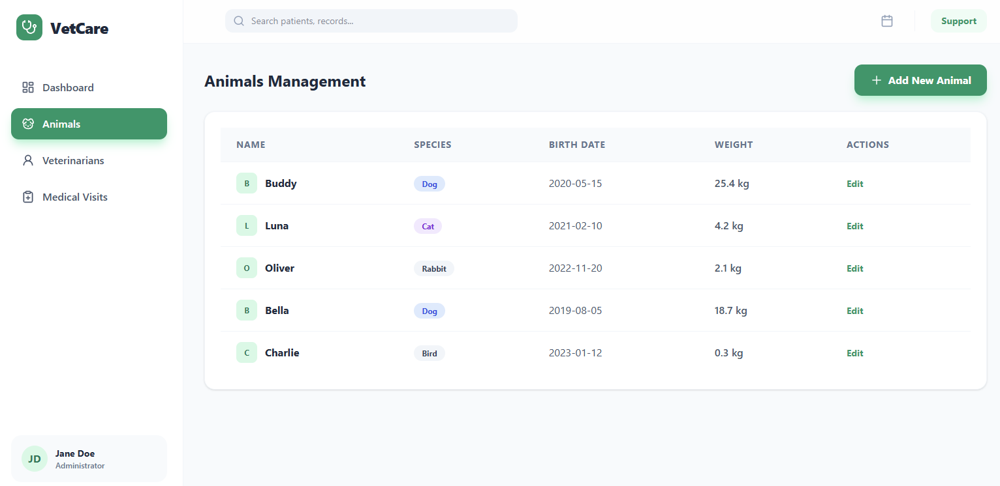
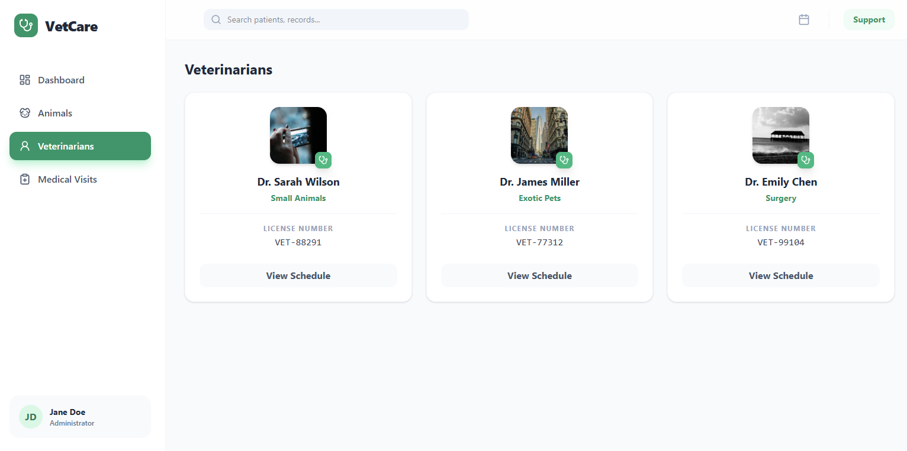
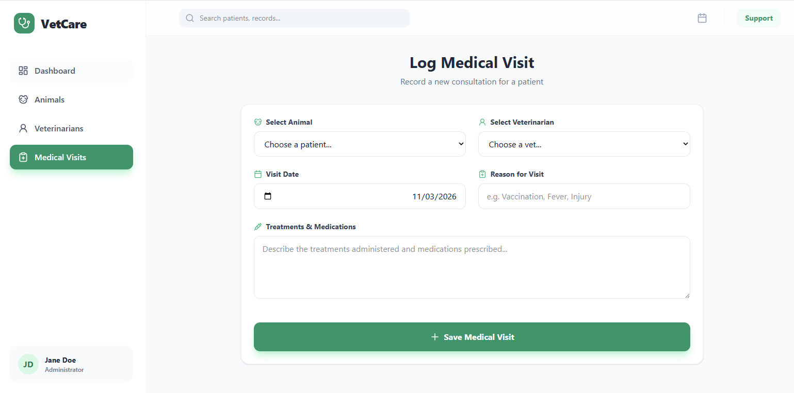
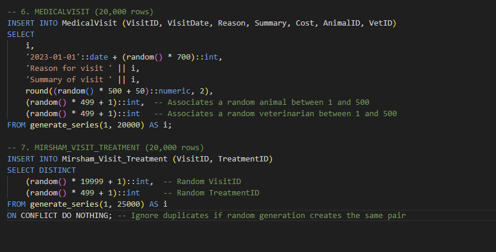
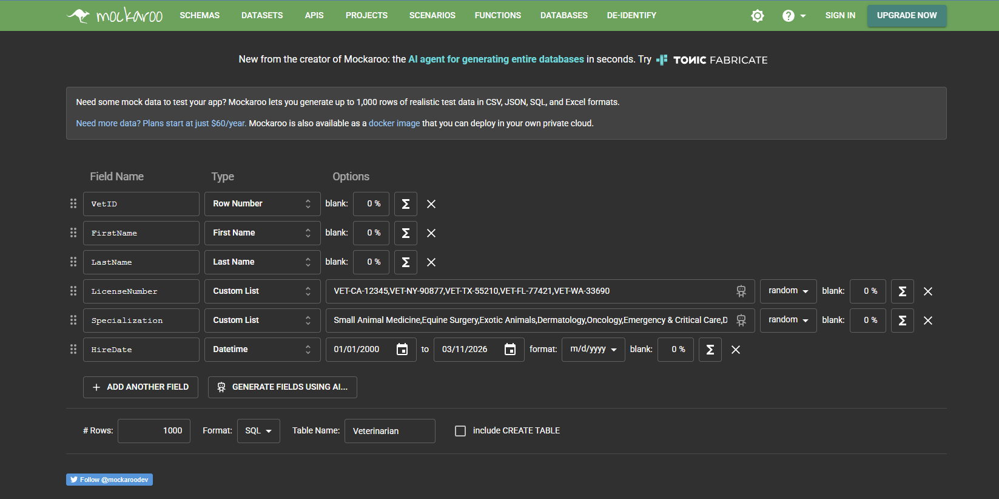
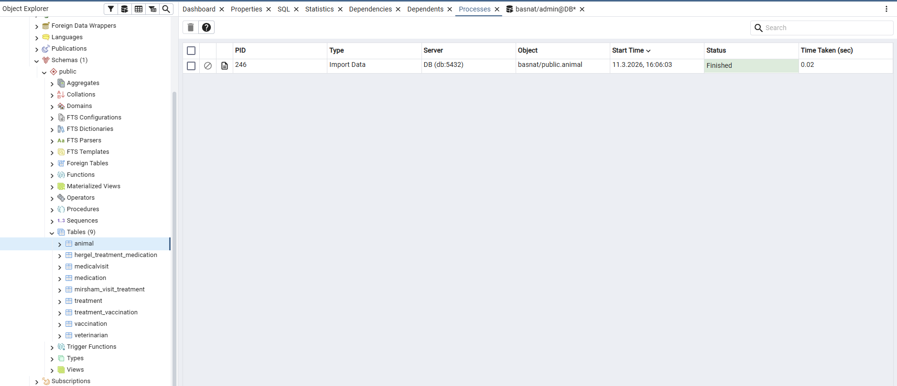

# 🏗️ Phase 1: Veterinary Information System (Zoo Management)

**Team Members:** Avinoam Muller 347465932, Guedalia Sebbah 337966659
**System Name:** VetCare Management System  
**Selected Module:** Clinic & Medical Administration  

---

## 📑 Table of Contents
1. [Introduction](#1-introduction)
2. [UI Prototypes (AI Generated)](#2-ui-prototypes-ai-generated)
3. [Database Design & Diagrams](#3-database-design--diagrams)
4. [Design Decisions & Architecture](#4-design-decisions--architecture)
5. [Data Population Methods](#5-data-population-methods)
6. [Backup and Restoration](#6-backup-and-restoration)
7. [How to Run the Project](#7-how-to-run-the-project)

---

## 1. Introduction

### System Overview
This system is strictly bounded to the medical administration of a veterinary clinic or zoo environment. It manages the entities directly involved in veterinary care, ensuring smooth tracking of patient history, staff assignments, and medical inventory.

### Core Functionalities
* **Patient Management:** Registering and tracking animals, their species, weight, and general information.
* **Staff Management:** Managing veterinarian profiles, their specializations, and licensing details.
* **Medical Records:** Logging medical visits, associating them with specific animals and attending veterinarians, and recording diagnostic summaries.
* **Treatment & Inventory Tracking:** Prescribing treatments, managing medication administration, and tracking vaccination schedules using junction tables to handle complex many-to-many relationships.

*(Note: This module does not handle external operations such as zoo ticketing, visitor management, or animal habitat assignments).*

---

## 2. UI Prototypes (AI Generated)

To visualize the end product, we used Google AI Studio in a Top-Down approach to generate the initial frontend screens. These mockups dictate the data we need to store and retrieve.

**Live Prototype Link:** [VetCare AI Studio App](https://ai.studio/apps/ea7d4031-ccb2-46c7-b09e-0782118e6fed)

> 🖼️ ** > *Caption: The main dashboard summarizing daily clinic activity.*

> 🖼️ ** > *Caption: The interface for adding and managing animal profiles.*

> 🖼️ ** > *Caption: The interface for adding and managing veterinarian profiles.*

> 🖼️ ** > *Caption: The interface for adding and managing medical visits.*

---

## 3. Database Design & Diagrams

Our database is designed to reflect the physical realities of a veterinary clinic, following standard relational design principles (normalized to at least 3NF).

### Entity Relationship Diagram (ERD)
> 🖼️ ** ### Data Structure Diagram (DSD)
> 🖼️ ** ---

## 4. Design Decisions & Architecture

* **Normalization (3NF):** We utilized junction tables (e.g., `Mirsham_Visit_Treatment`, `Hergel_Treatment_Medication`) to resolve many-to-many relationships between medical visits, treatments, and prescriptions. This prevents data duplication and update anomalies.
* **Data Integrity (Constraints):** We implemented strict constraints, including `NOT NULL` for critical fields, `UNIQUE` for veterinarian license numbers, and cascading deletes/updates for foreign keys to ensure orphaned records do not clutter the database.
* **Data Types:** Appropriate data types were selected, such as `DATE` for tracking birthdates and hire dates, and `DECIMAL` for weights and costs, ensuring accurate calculations and sorting capabilities.

---

## 5. Data Population Methods

To ensure a robust testing environment, the database was populated with realistic mock data using three distinct methods. We met the strict requirement of generating at least **500 records** for standard tables, and **over 20,000 records** for two heavy-volume tables (e.g., `MedicalVisit` and junction tables).

### Method 1: Database Scripting / Code Generation (generate_series)
We utilized advanced PostgreSQL scripting (`generate_series()` combined with `ARRAY` and `random()` logic) to programmatically generate large-scale datasets directly within the SQL engine. This was highly efficient for reaching the 20,000+ row requirement.
> 🖼️ ** > *Caption: Executing programmatic inserts in pgAdmin.*

### Method 2: External Data Generators (Mockaroo)
For specialized textual data that requires realistic formatting (e.g., Veterinarian names, License Numbers), we used Mockaroo to generate high-fidelity test data, which was then exported as SQL insert statements.
> 🖼️ ** > *Caption: Configuring realistic data generation via Mockaroo.*

### Method 3: CSV Import via Python/pgAdmin
Static lookup tables (such as Medication catalogs) were structured in CSV format. These were ingested into the database to accurately map active ingredients and expiration dates.
> 🖼️ ** > *Caption: Importing structured CSV data into the database.*

---

## 6. Backup and Restoration

To guarantee data integrity and allow for a complete system rebuild from scratch, a full logical backup of the database was performed and successfully tested.

### Backup Process
The backup encapsulates both the **DDL** (schemas) and the **DML** (all generated records) in a single restorable file.
> 🖼️ ** > *Caption: Initiating the database backup in pgAdmin.*

### Restoration Test
The environment—including all relationships, constraints, and the 20,000+ mock data rows—was successfully restored on a fresh instance to verify the integrity of the backup file.
> 🖼️ ** > *Caption: Confirmation of successful database restoration.*

---

## 7. How to Run the Project

### Prerequisites
* **Docker Desktop** installed and running

### Step 1: Connect to pgAdmin

1. Open your browser and go to **http://localhost:8080**
2. Login with:
   - **Email:** `guedalia.sebbah@gmail.com`
   - **Password:** `guedalia050504`
3. Add a new server connection:
   - **Name:** `Basnat` (or any name)
   - **Host:** `db`
   - **Port:** `5432`
   - **Username:** `admin`
   - **Password:** `password`
   - **Maintenance database:** `basnat`

### Step 2: Import Animal Data (CSV)

1. In the pgAdmin sidebar, navigate to:  
   **Servers → Basnat → Databases → basnat → Schemas → public → Tables → Animal**
2. Right-click on the `Animal` table → **Import/Export Data...**
3. Configure the import:
   - **Import/Export:** Import
   - **Filename:** Select `Shlav1/DataImportFiles/MOCK_DATA.csv`
   - **Format:** CSV
   - **Header:** Yes
   - **Delimiter:** `,`
4. Click **OK** to import ~1,000 animal records.

### Step 3: Run the Remaining Data Scripts

1. In pgAdmin, open the **Query Tool** (Tools → Query Tool)
2. Click the **Open File** (📂) button
3. Open the file `Shlav1/Programing/insertTables.sql`
4. Click **Execute** (▶) or press `F5`

This will insert:
- **500** Treatment records
- **500** Medication records
- **500** Vaccination records
- **20,000+** MedicalVisit records
- **20,000+** Mirsham_Visit_Treatment records

### Step 5: Verify the Data

1. Open the **Query Tool** again
2. Open the file `Shlav1/selectAll.sql`
3. Execute it to verify all tables are populated correctly

> ⚠️ **Important:** Steps must be followed in order. The Animal CSV must be imported **before** running `insertTables.sql`, because `MedicalVisit` has foreign key references to both the `Animal` and `Veterinarian` tables.

### Summary of Data Sources

| Table | Source | Method | Row Count |
|-------|--------|--------|-----------|
| Animal | `MOCK_DATA.csv` | CSV Import (pgAdmin) | ~1,000 |
| Veterinarian | `mockaroo_veterinarians.sql` | Auto (Docker init) | 1,000 |
| Treatment | `insertTables.sql` | Manual (pgAdmin) | 500 |
| Medication | `insertTables.sql` | Manual (pgAdmin) | 500 |
| Vaccination | `insertTables.sql` | Manual (pgAdmin) | 500 |
| MedicalVisit | `insertTables.sql` | Manual (pgAdmin) | 20,000+ |
| Mirsham_Visit_Treatment | `insertTables.sql` | Manual (pgAdmin) | 20,000+ |
| Hergel_Treatment_Medication | — | To be populated | — |
| Treatment_Vaccination | — | To be populated | — |