# 🏗️ Phase 2: Veterinary Information System (Zoo Management)

**Team Members:** Avinoam Muller 347465932, Guedalia Sebbah 337966659  
**System Name:** VetCare Management System  
**Selected Module:** Clinic & Medical Administration  

---

## 📑 Table of Contents

1. [Schema Overview](#1-schema-overview)
2. [Double SELECT Queries (4 pairs)](#2-double-select-queries)
   - [2.1 Double Query 1 – Most expensive animal per species](#21-double-query-1--most-expensive-animal-per-species)
   - [2.2 Double Query 2 – Vets with heavy workload in 2024](#22-double-query-2--vets-with-heavy-workload-in-2024)
   - [2.3 Double Query 3 – Animals never treated as "Critical"](#23-double-query-3--animals-never-treated-as-critical)
   - [2.4 Double Query 4 – Monthly revenue by specialization](#24-double-query-4--monthly-revenue-by-specialization)
3. [Simple SELECT Queries (4)](#3-simple-select-queries)
   - [3.1 Top 10 most visited animals](#31-top-10-most-visited-animals)
   - [3.2 Treatment breakdown by severity](#32-treatment-breakdown-by-severity)
   - [3.3 Expired medications still linked to active treatments](#33-expired-medications-still-linked-to-active-treatments)
   - [3.4 Quarterly visit summary](#34-quarterly-visit-summary)
4. [DELETE Queries (3)](#4-delete-queries)
5. [UPDATE Queries (3)](#5-update-queries)
6. [Constraints (ALTER TABLE)](#6-constraints-alter-table)
7. [Transactions (ROLLBACK & COMMIT)](#7-transactions-rollback--commit)

---

## 1. Schema Overview

Our database contains 9 tables organized in 3NF:

| Table | Description | Row Count |
|-------|-------------|:---------:|
| `Animal` | Zoo animals (name, species, weight, etc.) | ~1,000 |
| `Veterinarian` | Veterinarians (name, specialization, license) | 800 |
| `MedicalVisit` | Medical visits (date, reason, cost) | 20,000+ |
| `Treatment` | Available treatments (description, severity) | 500 |
| `Medication` | Medications (commercial name, expiration date) | 500 |
| `Vaccination` | Vaccines (manufacturer, frequency, storage) | 500 |
| `Mirsham_Visit_Treatment` | Junction table: Visit ↔ Treatment | 20,000+ |
| `Hergel_Treatment_Medication` | Junction table: Treatment ↔ Medication | — |
| `Treatment_Vaccination` | Junction table: Treatment ↔ Vaccination | — |

---

## 2. Double SELECT Queries

> Each query is written in **two different versions** that return the **same result**. A detailed efficiency analysis accompanies each pair.

---

### 2.1 Double Query 1 – Most expensive animal per species

**Description:** For each species, find the animal with the highest average medical visit cost. Display the animal name, species, average cost, total visits, and birth year.
**תיאור:** עבור כל מין (species), מצא את החיה עם העלות הממוצעת הגבוהה ביותר לביקור רפואי. הצג את שם החיה, המין, עלות ממוצעת, סך הביקורים ושנת הלידה.

#### Version A – JOIN with a correlated subquery in HAVING

```sql
SELECT 
    a.AnimalID,
    a.Name              AS AnimalName,
    a.Species,
    ROUND(AVG(mv.Cost), 2)          AS AvgVisitCost,
    COUNT(mv.VisitID)               AS TotalVisits,
    EXTRACT(YEAR FROM a.BirthDate)  AS BirthYear
FROM Animal a
JOIN MedicalVisit mv ON a.AnimalID = mv.AnimalID
GROUP BY a.AnimalID, a.Name, a.Species, a.BirthDate
HAVING AVG(mv.Cost) = (
    SELECT MAX(sub.avg_cost)
    FROM (
        SELECT a2.Species AS sp, a2.AnimalID, AVG(mv2.Cost) AS avg_cost
        FROM Animal a2
        JOIN MedicalVisit mv2 ON a2.AnimalID = mv2.AnimalID
        GROUP BY a2.Species, a2.AnimalID
    ) sub
    WHERE sub.sp = a.Species
)
ORDER BY a.Species;
```

#### Version B – CTE with RANK() window function

```sql
WITH AnimalAvgCost AS (
    SELECT 
        a.AnimalID,
        a.Name              AS AnimalName,
        a.Species,
        ROUND(AVG(mv.Cost), 2)          AS AvgVisitCost,
        COUNT(mv.VisitID)               AS TotalVisits,
        EXTRACT(YEAR FROM a.BirthDate)  AS BirthYear,
        RANK() OVER (
            PARTITION BY a.Species 
            ORDER BY AVG(mv.Cost) DESC
        ) AS CostRank
    FROM Animal a
    JOIN MedicalVisit mv ON a.AnimalID = mv.AnimalID
    GROUP BY a.AnimalID, a.Name, a.Species, a.BirthDate
)
SELECT AnimalID, AnimalName, Species, AvgVisitCost, TotalVisits, BirthYear
FROM AnimalAvgCost
WHERE CostRank = 1
ORDER BY Species;
```

#### 📊 Execution Results

> 🖼️ 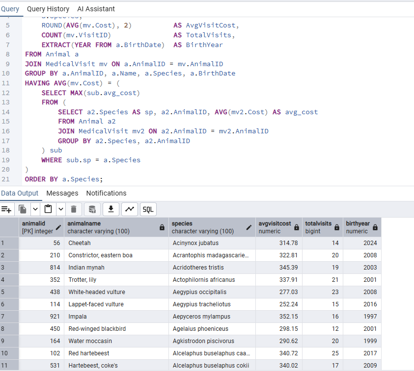
> *Caption: Result of Double Query 1 – Version A (correlated subquery in HAVING)*

> 🖼️ 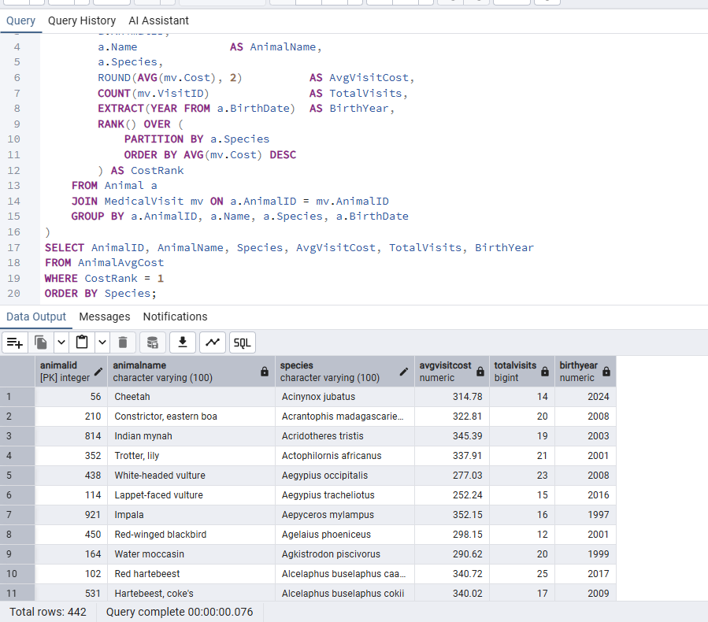
> *Caption: Result of Double Query 1 – Version B (CTE + RANK window function)*

#### 🔬 Efficiency Analysis (Oral Defense Preparation)

| Criterion | Version A (Correlated Subquery) | Version B (CTE + RANK) |
|-----------|----------------------------------|------------------------|
| **Subquery type** | Correlated – re-executed for each species group | None – single pass |
| **Complexity** | O(S × N) – S species × N animals | O(N log N) – single sort for ranking |
| **Mechanism** | HAVING re-computes the MAX for each species | RANK() computes all ranks in one pass |
| **Readability** | Hard to read (3 nesting levels) | Clear and modular thanks to the CTE |

**✅ Winner: Version B** – The `RANK()` window function entirely avoids the correlated subquery. It scans the data once, computes the aggregation, then performs a single-pass ranking. This is both faster and more readable.

---

### 2.2 Double Query 2 – Vets with heavy workload in 2024

**Description:** Identify veterinarians who treated more than 30 distinct animals in 2024. Show their full name, specialization, visit count, and total revenue generated.
**תיאור:** זיהוי וטרינרים שטיפלו ביותר מ-30 חיות שונות בשנת 2024. הצג את שמם המלא, התמחות, מספר הביקורים וסך ההכנסות שנוצרו.

#### Version A – Using IN with a subquery

```sql
SELECT 
    v.VetID,
    v.FirstName || ' ' || v.LastName    AS VetFullName,
    v.Specialization,
    COUNT(mv.VisitID)                   AS VisitsIn2024,
    ROUND(SUM(mv.Cost), 2)             AS TotalRevenue,
    EXTRACT(YEAR FROM v.HireDate)       AS HireYear
FROM Veterinarian v
JOIN MedicalVisit mv ON v.VetID = mv.VetID
WHERE EXTRACT(YEAR FROM mv.VisitDate) = 2024
  AND v.VetID IN (
      SELECT mv2.VetID
      FROM MedicalVisit mv2
      WHERE EXTRACT(YEAR FROM mv2.VisitDate) = 2024
      GROUP BY mv2.VetID
      HAVING COUNT(DISTINCT mv2.AnimalID) > 30
  )
GROUP BY v.VetID, v.FirstName, v.LastName, v.Specialization, v.HireDate
ORDER BY VisitsIn2024 DESC;
```

#### Version B – Using EXISTS with a correlated subquery

```sql
SELECT 
    v.VetID,
    v.FirstName || ' ' || v.LastName    AS VetFullName,
    v.Specialization,
    COUNT(mv.VisitID)                   AS VisitsIn2024,
    ROUND(SUM(mv.Cost), 2)             AS TotalRevenue,
    EXTRACT(YEAR FROM v.HireDate)       AS HireYear
FROM Veterinarian v
JOIN MedicalVisit mv ON v.VetID = mv.VetID
WHERE EXTRACT(YEAR FROM mv.VisitDate) = 2024
  AND EXISTS (
      SELECT 1
      FROM MedicalVisit mv2
      WHERE mv2.VetID = v.VetID
        AND EXTRACT(YEAR FROM mv2.VisitDate) = 2024
      GROUP BY mv2.VetID
      HAVING COUNT(DISTINCT mv2.AnimalID) > 30
  )
GROUP BY v.VetID, v.FirstName, v.LastName, v.Specialization, v.HireDate
ORDER BY VisitsIn2024 DESC;
```

#### 📊 Execution Results

> 🖼️ 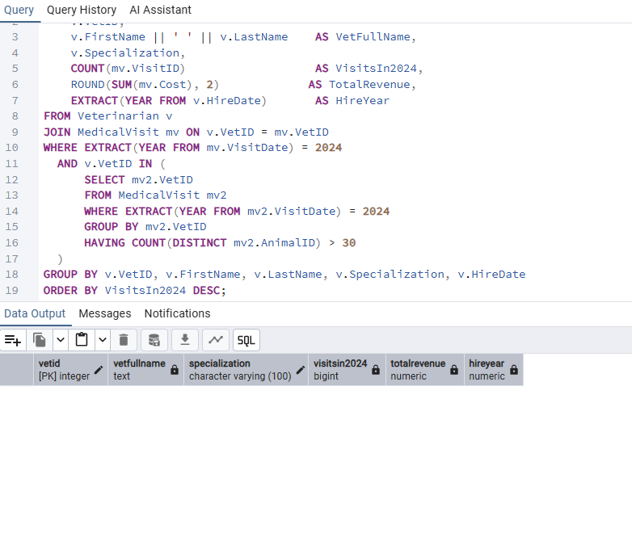
> *Caption: Result of Double Query 2 – Version A (IN subquery)*

> 🖼️ 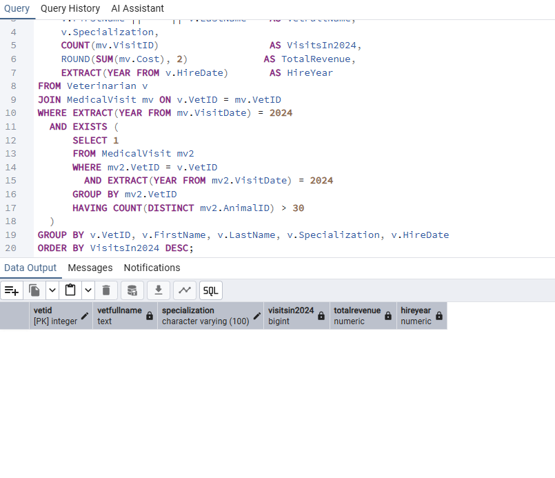
> *Caption: Result of Double Query 2 – Version B (EXISTS correlated subquery)*

#### 🔬 Efficiency Analysis (Oral Defense Preparation)

| Criterion | Version A (IN) | Version B (EXISTS) |
|-----------|----------------|---------------------|
| **Subquery execution** | ONCE – produces a list of VetIDs | CORRELATED – evaluated per veterinarian row |
| **PostgreSQL strategy** | Hash Semi-Join – O(1) per lookup | Must aggregate per vet – O(V × M) |
| **Performance** | Proportional to subquery result size | Proportional to V (vets) × M (visits/vet) |
| **Short-circuit** | N/A | EXISTS can stop at first row, BUT the GROUP BY/HAVING inside cancels this |

**✅ Winner: Version A** – The `IN` approach is more efficient because:
1. The subquery executes **only once** and produces a small set of VetIDs.
2. PostgreSQL uses a **Hash Semi-Join** for matching, which is O(1) per lookup.
3. The `EXISTS` version must repeatedly aggregate data per veterinarian.

---

### 2.3 Double Query 3 – Animals never treated as "Critical"

**Description:** Find all animals that received medical care but were NEVER assigned a treatment of "Critical" severity. Display their ID, name, species, gender, weight, and age.
**תיאור:** מצא את כל החיות שקיבלו טיפול רפואי אך מעולם לא הוקצה להן טיפול בדרגת חומרה "Critical" (קריטי). הצג את המזהה שלהן, שם, מין, מגדר, משקל וגיל.

#### Version A – Using NOT IN

```sql
SELECT 
    a.AnimalID,
    a.Name          AS AnimalName,
    a.Species,
    a.Gender,
    a.Weight,
    EXTRACT(YEAR FROM AGE(a.BirthDate)) AS AgeInYears
FROM Animal a
WHERE a.AnimalID NOT IN (
    SELECT DISTINCT mv.AnimalID
    FROM MedicalVisit mv
    JOIN Mirsham_Visit_Treatment mvt ON mv.VisitID = mvt.VisitID
    JOIN Treatment t ON mvt.TreatmentID = t.TreatmentID
    WHERE t.Severity = 'Critical'
)
AND a.AnimalID IN (
    SELECT mv.AnimalID FROM MedicalVisit mv
)
ORDER BY a.Species, a.Name;
```

#### Version B – Using NOT EXISTS

```sql
SELECT 
    a.AnimalID,
    a.Name          AS AnimalName,
    a.Species,
    a.Gender,
    a.Weight,
    EXTRACT(YEAR FROM AGE(a.BirthDate)) AS AgeInYears
FROM Animal a
WHERE NOT EXISTS (
    SELECT 1
    FROM MedicalVisit mv
    JOIN Mirsham_Visit_Treatment mvt ON mv.VisitID = mvt.VisitID
    JOIN Treatment t ON mvt.TreatmentID = t.TreatmentID
    WHERE t.Severity = 'Critical'
      AND mv.AnimalID = a.AnimalID
)
AND EXISTS (
    SELECT 1 FROM MedicalVisit mv WHERE mv.AnimalID = a.AnimalID
)
ORDER BY a.Species, a.Name;
```

#### 📊 Execution Results

> 🖼️ 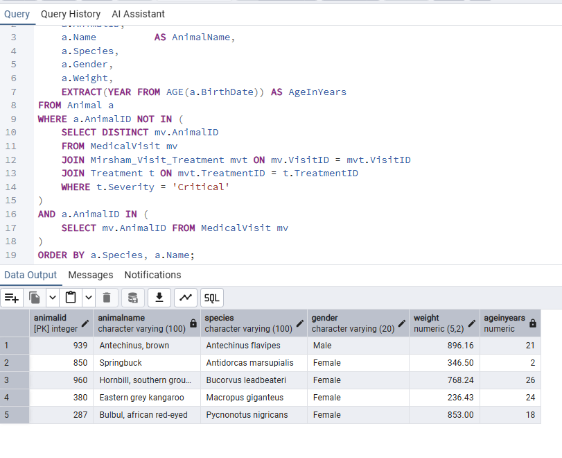
> *Caption: Result of Double Query 3 – Version A (NOT IN)*

> 🖼️ 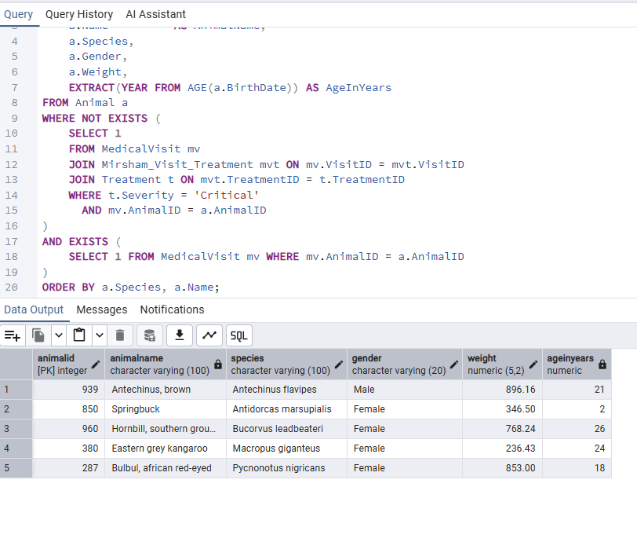
> *Caption: Result of Double Query 3 – Version B (NOT EXISTS)*

#### 🔬 Efficiency Analysis (Oral Defense Preparation)

| Criterion | Version A (NOT IN) | Version B (NOT EXISTS) |
|-----------|--------------------|------------------------|
| **NULL handling** | ⚠️ **DANGEROUS**: if any AnimalID is NULL in the result, NOT IN returns 0 rows | ✅ **NULL-SAFE**: checks row existence, not value equality |
| **Materialization** | Must materialize the full set before comparing | Short-circuits at the first matching row |
| **PostgreSQL plan** | Anti-Join after full materialization | Optimized Anti Semi-Join (Hash or Merge) |
| **Complexity** | O(N × M) in the worst case | O(N × log M) with an index |

**✅ Winner: Version B** – `NOT EXISTS` is superior for two reasons:
1. **NULL Safety**: `NOT EXISTS` correctly handles NULLs by checking row existence rather than value equality. `NOT IN` with a NULL anywhere in the subquery returns **zero rows** — a very common and dangerous bug.
2. **Short-circuit**: PostgreSQL stops scanning as soon as it finds one match, whereas `NOT IN` must materialize the entire set.

---

### 2.4 Double Query 4 – Monthly revenue by specialization

**Description:** Show, for each month of 2024, the total revenue and visit count per veterinary specialization, with the average cost per visit.
**תיאור:** הצג, עבור כל חודש בשנת 2024, את סך ההכנסות ומספר הביקורים לכל התמחות וטרינרית, יחד עם העלות הממוצעת לביקור.

#### Version A – Derived table (subquery in FROM)

```sql
SELECT 
    monthly.VisitMonth,
    monthly.Specialization,
    monthly.TotalRevenue,
    monthly.VisitCount,
    monthly.AvgCostPerVisit
FROM (
    SELECT 
        EXTRACT(MONTH FROM mv.VisitDate)    AS VisitMonth,
        v.Specialization,
        ROUND(SUM(mv.Cost), 2)              AS TotalRevenue,
        COUNT(mv.VisitID)                   AS VisitCount,
        ROUND(AVG(mv.Cost), 2)              AS AvgCostPerVisit
    FROM MedicalVisit mv
    JOIN Veterinarian v ON mv.VetID = v.VetID
    WHERE EXTRACT(YEAR FROM mv.VisitDate) = 2024
    GROUP BY EXTRACT(MONTH FROM mv.VisitDate), v.Specialization
) monthly
ORDER BY monthly.VisitMonth, monthly.TotalRevenue DESC;
```

#### Version B – CTE (WITH clause)

```sql
WITH MonthlyRevenue AS (
    SELECT 
        EXTRACT(MONTH FROM mv.VisitDate)    AS VisitMonth,
        v.Specialization,
        ROUND(SUM(mv.Cost), 2)              AS TotalRevenue,
        COUNT(mv.VisitID)                   AS VisitCount,
        ROUND(AVG(mv.Cost), 2)              AS AvgCostPerVisit
    FROM MedicalVisit mv
    JOIN Veterinarian v ON mv.VetID = v.VetID
    WHERE EXTRACT(YEAR FROM mv.VisitDate) = 2024
    GROUP BY EXTRACT(MONTH FROM mv.VisitDate), v.Specialization
)
SELECT VisitMonth, Specialization, TotalRevenue, VisitCount, AvgCostPerVisit
FROM MonthlyRevenue
ORDER BY VisitMonth, TotalRevenue DESC;
```

#### 📊 Execution Results

> 🖼️ 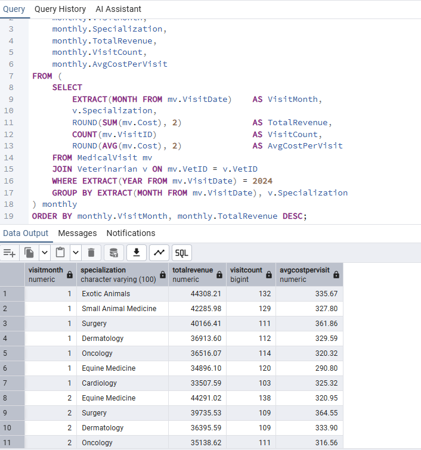
> *Caption: Result of Double Query 4 – Version A (derived table)*

> 🖼️ 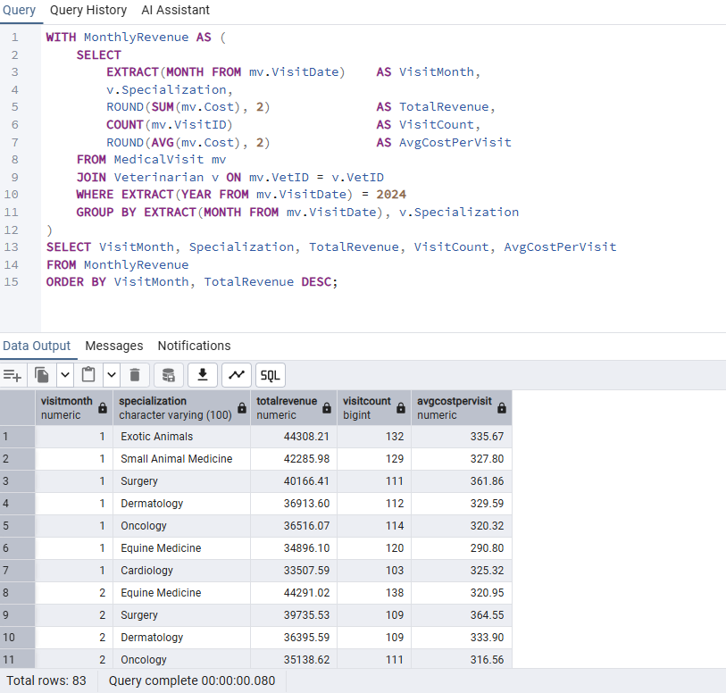
> *Caption: Result of Double Query 4 – Version B (CTE)*

#### 🔬 Efficiency Analysis (Oral Defense Preparation)

| Criterion | Version A (Derived Table) | Version B (CTE) |
|-----------|---------------------------|------------------|
| **Inlining** | Always inlined by the optimizer | Inlined since PostgreSQL 12+ |
| **Execution plan** | Identical to Version B (PG 12+) | Identical to Version A (PG 12+) |
| **Reusability** | Limited – the subquery is nested | The CTE can be referenced multiple times |
| **Readability** | Acceptable for short queries | Superior for complex queries |
| **PostgreSQL < 12** | ✅ Always optimized | ⚠️ Always materialized (optimization fence) |

**✅ Verdict: TIE (PostgreSQL 12+)** – Both produce the same execution plan. The CTE version wins on **readability and maintainability**. On PostgreSQL < 12, Version A is preferable as the CTE would be unnecessarily materialized.

---

## 3. Simple SELECT Queries

---

### 3.1 Top 10 most visited animals

**Description:** Show the 10 animals with the highest number of medical visits, with their full profile: species, gender, weight, age, date of last visit, total cost, and average cost per visit.
**תיאור:** הצג את 10 החיות עם המספר הגבוה ביותר של ביקורים רפואיים, עם הפרופיל המלא שלהן: סוג, מגדר, משקל, גיל, תאריך ביקור אחרון, סך ההוצאות ועלות ממוצעת לביקור.

```sql
SELECT 
    a.AnimalID,
    a.Name                              AS AnimalName,
    a.Species,
    a.Gender,
    a.Weight                            AS WeightKg,
    EXTRACT(YEAR FROM AGE(a.BirthDate)) AS AgeInYears,
    COUNT(mv.VisitID)                   AS TotalVisits,
    MAX(mv.VisitDate)                   AS LastVisitDate,
    ROUND(SUM(mv.Cost), 2)             AS TotalCostSpent,
    ROUND(AVG(mv.Cost), 2)             AS AvgCostPerVisit
FROM Animal a
JOIN MedicalVisit mv ON a.AnimalID = mv.AnimalID
GROUP BY a.AnimalID, a.Name, a.Species, a.Gender, a.Weight, a.BirthDate
ORDER BY TotalVisits DESC
LIMIT 10;
```

**Complex elements used:** `JOIN`, `GROUP BY` (6 columns), `COUNT`, `MAX`, `SUM`, `AVG`, `ROUND`, `EXTRACT(YEAR FROM AGE())`, `ORDER BY`, `LIMIT`.

#### 📊 Execution Result

> 🖼️ 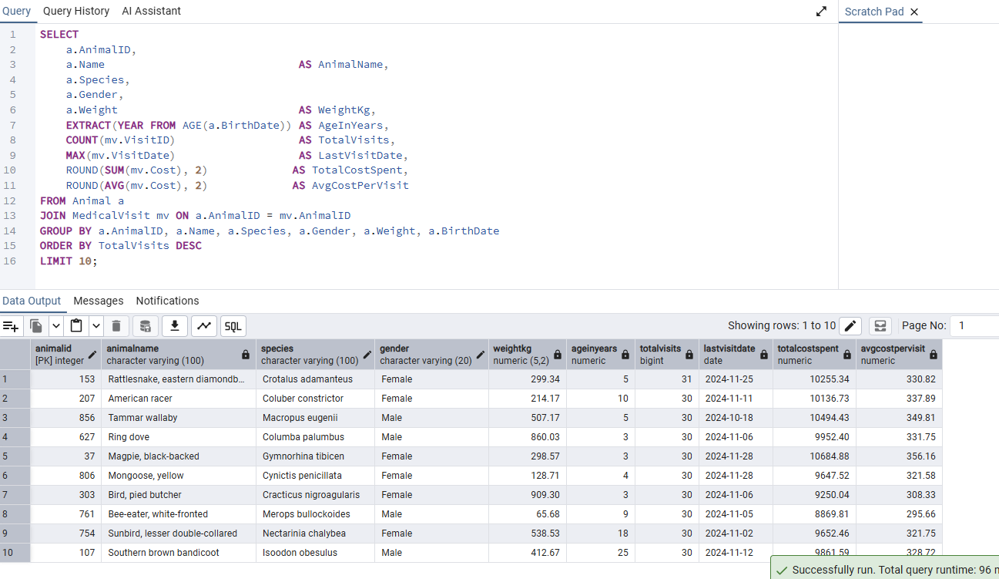
> *Caption: Top 10 most visited animals with full cost profile*

---

### 3.2 Treatment breakdown by severity

**Description:** For each treatment, display its severity, the number of visits that used it, and the number of distinct medications associated with it. This identifies the most-used and best-equipped treatments.
**תיאור:** עבור כל טיפול, הצג את רמת החומרה שלו, מספר הביקורים שהשתמשו בו, ומספר התרופות השונות הקשורות אליו. שאילתה זו מזהה את הטיפולים הנפוצים ביותר והמצוידים ביותר.

```sql
SELECT 
    t.TreatmentID,
    t.Description       AS TreatmentDesc,
    t.Type              AS TreatmentType,
    t.Severity,
    t.Duration,
    COUNT(DISTINCT mvt.VisitID)     AS TimesUsedInVisits,
    COUNT(DISTINCT htm.MedID)       AS DistinctMedications
FROM Treatment t
LEFT JOIN Mirsham_Visit_Treatment mvt ON t.TreatmentID = mvt.TreatmentID
LEFT JOIN Hergel_Treatment_Medication htm ON t.TreatmentID = htm.TreatmentID
GROUP BY t.TreatmentID, t.Description, t.Type, t.Severity, t.Duration
HAVING COUNT(DISTINCT mvt.VisitID) > 0
ORDER BY TimesUsedInVisits DESC, t.Severity
LIMIT 20;
```

**Complex elements used:** Double `LEFT JOIN`, `COUNT(DISTINCT ...)`, `GROUP BY` (5 columns), `HAVING`, multi-column `ORDER BY`.

#### 📊 Execution Result

> 🖼️ 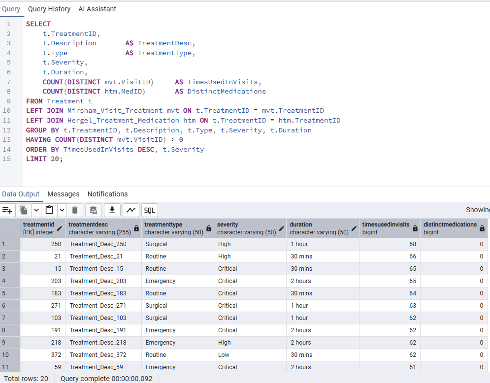
> *Caption: Treatment breakdown by severity with visit count and medication count*

---

### 3.3 Expired medications still linked to active treatments

**Description:** Identify medications whose expiration date has passed but that are still associated with treatments used in visits that occurred AFTER the expiration date. This is an essential **quality control** query.
**תיאור:** זיהוי תרופות שתאריך התפוגה שלהן חלף אך הן עדיין מקושרות לטיפולים שנעשה בהם שימוש בביקורים שהתרחשו לאחר מועד התפוגה. זוהי שאילתת **בקרת איכות** חיונית.

```sql
SELECT 
    m.MedID,
    m.CommercialName,
    m.ActiveIngredient,
    m.DosageUnit,
    m.ExpirationDate,
    t.TreatmentID,
    t.Description       AS TreatmentDesc,
    t.Severity,
    MAX(mv.VisitDate)   AS LatestVisitUsingExpiredMed
FROM Medication m
JOIN Hergel_Treatment_Medication htm ON m.MedID = htm.MedID
JOIN Treatment t ON htm.TreatmentID = t.TreatmentID
JOIN Mirsham_Visit_Treatment mvt ON t.TreatmentID = mvt.TreatmentID
JOIN MedicalVisit mv ON mvt.VisitID = mv.VisitID
WHERE m.ExpirationDate < CURRENT_DATE
  AND mv.VisitDate > m.ExpirationDate
GROUP BY m.MedID, m.CommercialName, m.ActiveIngredient, m.DosageUnit,
         m.ExpirationDate, t.TreatmentID, t.Description, t.Severity
ORDER BY m.ExpirationDate ASC
LIMIT 15;
```

**Complex elements used:** Chain of 4 `JOIN`s spanning 5 tables, date comparison (`ExpirationDate < CURRENT_DATE`), `GROUP BY` (8 columns), `MAX` on dates.

#### 📊 Execution Result

> 🖼️ 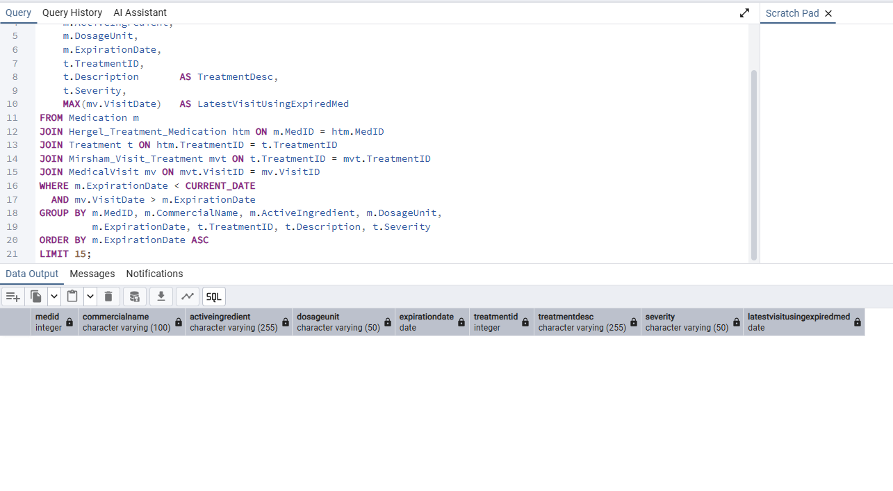
> *Caption: Expired medications still linked to visits after their expiration date*

---

### 3.4 Quarterly visit summary

**Description:** Generate a quarterly business dashboard showing visit count, unique animals, active vets, total revenue, average, maximum, and minimum cost per visit.
**תיאור:** יצירת לוח בקרה (dashboard) עסקי רבעוני המציג מספר ביקורים, חיות ייחודיות, וטרינרים פעילים, סך הכנסות, וכן עלות ממוצעת, מקסימלית ומינימלית לביקור.

```sql
SELECT 
    EXTRACT(YEAR FROM mv.VisitDate)                AS VisitYear,
    EXTRACT(QUARTER FROM mv.VisitDate)             AS VisitQuarter,
    COUNT(mv.VisitID)                              AS TotalVisits,
    COUNT(DISTINCT mv.AnimalID)                    AS UniqueAnimals,
    COUNT(DISTINCT mv.VetID)                       AS ActiveVets,
    ROUND(SUM(mv.Cost), 2)                         AS TotalRevenue,
    ROUND(AVG(mv.Cost), 2)                         AS AvgCostPerVisit,
    ROUND(MAX(mv.Cost), 2)                         AS MaxVisitCost,
    ROUND(MIN(mv.Cost), 2)                         AS MinVisitCost
FROM MedicalVisit mv
GROUP BY EXTRACT(YEAR FROM mv.VisitDate), EXTRACT(QUARTER FROM mv.VisitDate)
ORDER BY VisitYear, VisitQuarter;
```

**Complex elements used:** `EXTRACT(YEAR)`, `EXTRACT(QUARTER)`, `COUNT(DISTINCT ...)`, `SUM`, `AVG`, `MAX`, `MIN`, `GROUP BY` on date extraction functions.

#### 📊 Execution Result

> 🖼️ 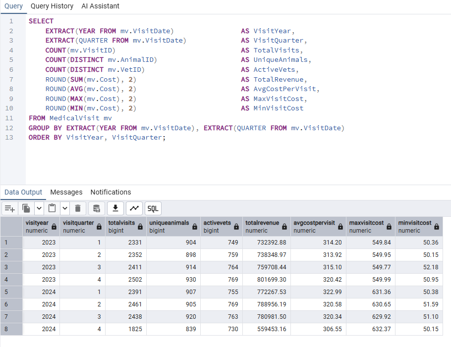
> *Caption: Quarterly visit summary with full revenue and activity metrics*

---

## 4. DELETE Queries

---

### 4.1 DELETE 1 – Cleanup of old low-cost visits

**Description:** Delete all medical visits older than 18 months with a cost below 100, **except** those linked to a "Critical" severity treatment (safety measure).
**תיאור:** מחק את כל הביקורים הרפואיים הישנים מ-18 חודשים שעלותם נמוכה מ-100, **למעט** אלו המקושרים לטיפול בדרגת חומרה "Critical" (אמצעי בטיחות).

```sql
DELETE FROM MedicalVisit
WHERE VisitDate < CURRENT_DATE - INTERVAL '18 months'
  AND Cost < 100
  AND VisitID NOT IN (
      SELECT mvt.VisitID FROM Mirsham_Visit_Treatment mvt
      JOIN Treatment t ON mvt.TreatmentID = t.TreatmentID
      WHERE t.Severity = 'Critical'
  );
```

**Complexity:** Subquery with `JOIN` to exclude critical visits. Date arithmetic with `INTERVAL`.

#### 📊 Execution Result

> 🖼️ 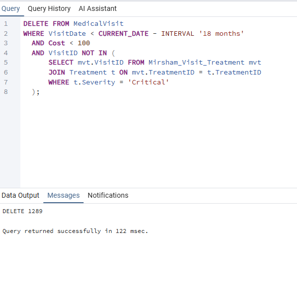
> *Caption: DELETE 1 – number of rows deleted shown in the query result panel*

---

### 4.2 DELETE 2 – Removal of orphaned treatments

**Description:** Delete treatments that have **never been used** in any visit, are not linked to any medication, and are not associated with any vaccine. These are useless orphaned records.
**תיאור:** מחק טיפולים ש**מעולם לא נעשה בהם שימוש** בשום ביקור, אינם מקושרים לאף תרופה, ואינם משויכים לשום חיסון. אלו רשומות "יתומות" חסרות תועלת.

```sql
DELETE FROM Treatment
WHERE TreatmentID NOT IN (
    SELECT TreatmentID FROM Mirsham_Visit_Treatment
)
AND TreatmentID NOT IN (
    SELECT TreatmentID FROM Hergel_Treatment_Medication
)
AND TreatmentID NOT IN (
    SELECT TreatmentID FROM Treatment_Vaccination
);
```

**Complexity:** Triple `NOT IN` checking absence of the treatment in three different junction tables.

#### 📊 Execution Result

> 🖼️ 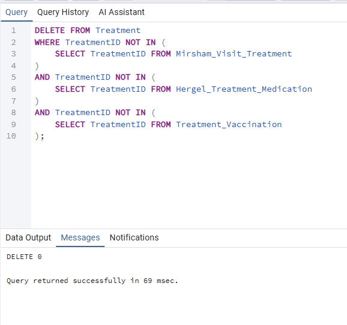
> *Caption: DELETE 2 – orphaned treatment records removed*

---

### 4.3 DELETE 3 – Removal of unused expired medications

**Description:** Delete medications whose expiration date has passed and that are not linked to any treatment. This is a safe cleanup of the obsolete inventory.
**תיאור:** מחק תרופות שתאריך התפוגה שלהן עבר ושאינן מקושרות לאף טיפול. זהו ניקוי בטוח של מלאי מיושן.

```sql
DELETE FROM Medication
WHERE ExpirationDate < CURRENT_DATE
  AND MedID NOT IN (
      SELECT MedID FROM Hergel_Treatment_Medication
  );
```

**Complexity:** Combination of a date condition and a `NOT IN` subquery to ensure no active treatment depends on the medication.

#### 📊 Execution Result

> 🖼️ 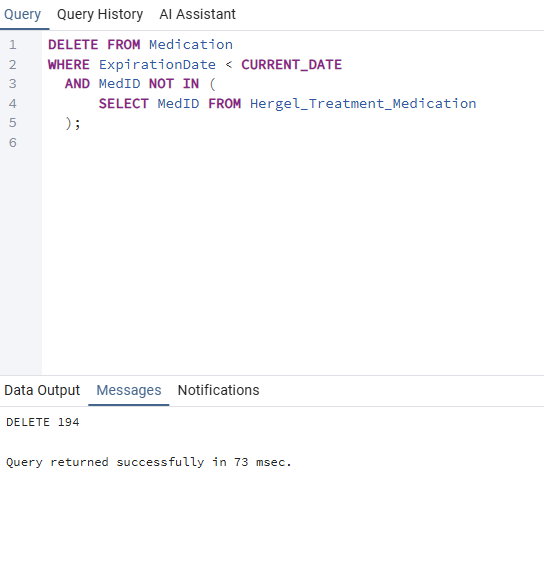
> *Caption: DELETE 3 – expired and unused medication records removed*

---

## 5. UPDATE Queries

---

### 5.1 UPDATE 1 – 15% cost increase for surgical visits in 2024

**Description:** Apply a 15% price increase to the cost of all medical visits handled by veterinarians with the `'Surgery'` specialization during the year 2024.
**תיאור:** החל העלאת מחיר של 15% על העלות של כל הביקורים הרפואיים שטופלו על ידי וטרינרים עם התמחות בכירוגיה (`'Surgery'`) במהלך שנת 2024.

```sql
UPDATE MedicalVisit
SET Cost = ROUND(Cost * 1.15, 2)
WHERE VetID IN (
    SELECT VetID 
    FROM Veterinarian 
    WHERE Specialization = 'Surgery'
)
AND EXTRACT(YEAR FROM VisitDate) = 2024;
```

**Complexity:** `IN` subquery to filter by veterinarian specialization. Use of `ROUND` for decimal precision. Year extraction with `EXTRACT`.

#### 📊 Execution Result

> 🖼️ 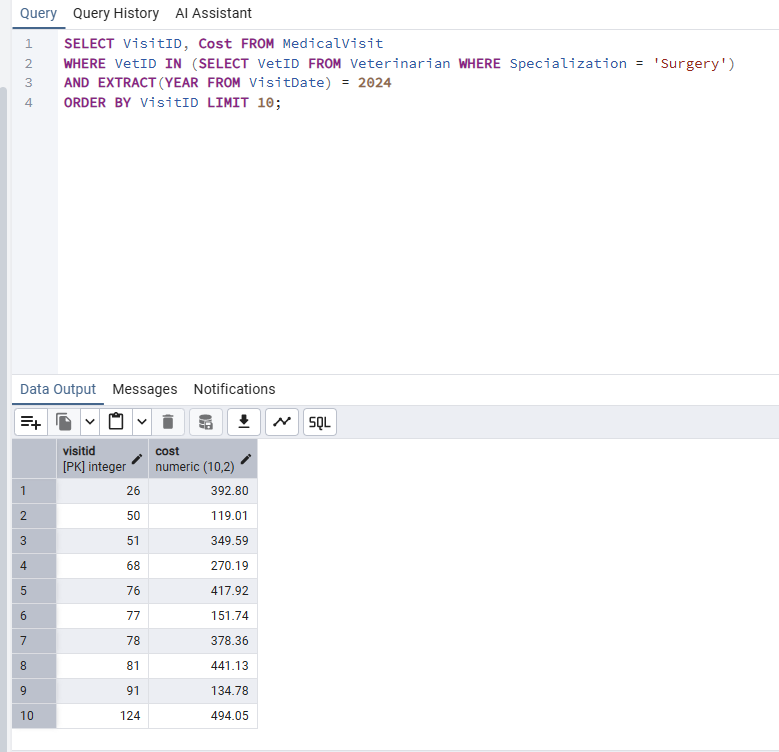
> *Caption: UPDATE 1 – Sample of costs BEFORE the 15% increase*

> 🖼️ 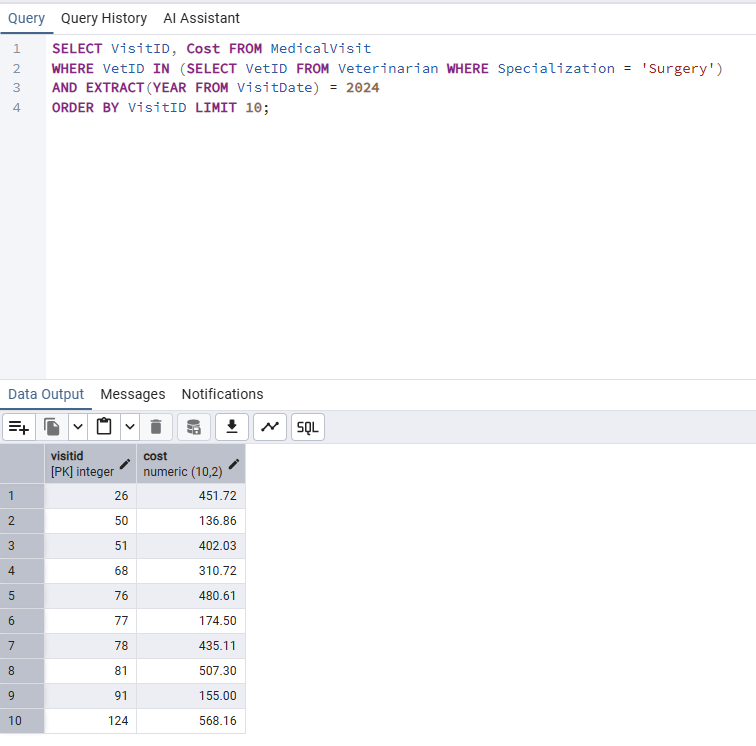
> *Caption: UPDATE 1 – Same rows AFTER the 15% increase is applied*

---

### 5.2 UPDATE 2 – Severity promotion for heavily used treatments

**Description:** Treatments with "Medium" severity that have been used in more than 50 visits are reclassified to "High" severity. Business logic: a frequently prescribed treatment is probably more significant than initially assessed.
**תיאור:** טיפולים בדרגת חומרה "Medium" שנעשה בהם שימוש ביותר מ-50 ביקורים מסווגים מחדש לדרגת חומרה "High". היגיון עסקי: טיפול שנרשם לעיתים קרובות ככל הנראה משמעותי יותר מההערכה הראשונית.

```sql
UPDATE Treatment
SET Severity = 'High'
WHERE Severity = 'Medium'
  AND TreatmentID IN (
      SELECT TreatmentID
      FROM Mirsham_Visit_Treatment
      GROUP BY TreatmentID
      HAVING COUNT(VisitID) > 50
  );
```

**Complexity:** Subquery with `GROUP BY` and `HAVING` to calculate usage count. Double `WHERE` condition combining current severity and subquery result.

#### 📊 Execution Result

> 🖼️ 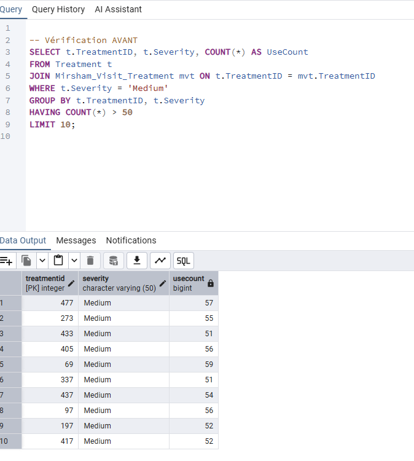
> *Caption: UPDATE 2 – Treatments with severity 'Medium' and usage > 50, BEFORE update*

> 🖼️ 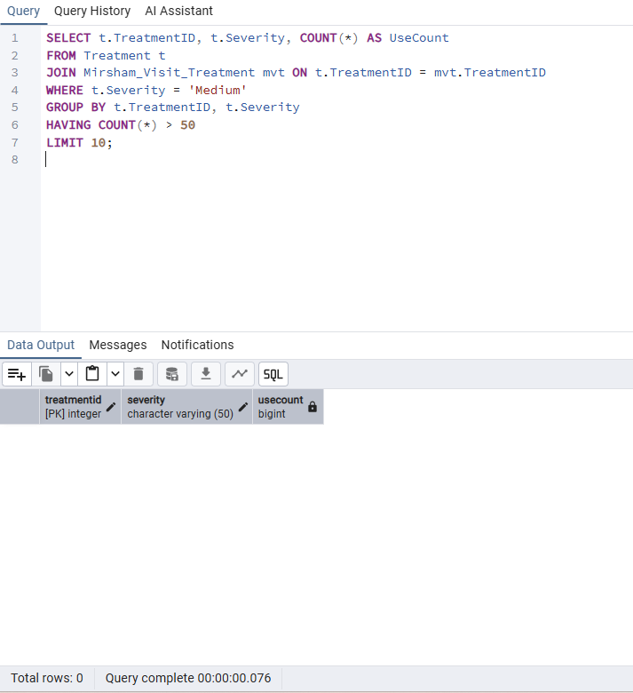
> *Caption: UPDATE 2 – Same treatments now showing 'High' severity*

---

### 5.3 UPDATE 3 – Extend expiration date for in-use medications

**Description:** Extend by 6 months the expiration date of medications that are currently in use (linked to at least one treatment) and expiring within the next 3 months. This simulates an administrative extension decision.
**תיאור:** הארך ב-6 חודשים את תאריך התפוגה של תרופות שנמצאות כעת בשימוש (מקושרות לפחות לטיפול אחד) ועומדות לפוג במהלך ה-3 חודשים הקרובים. פעולה זו מדמה החלטה מנהלית על הארכת תוקף.

```sql
UPDATE Medication
SET ExpirationDate = ExpirationDate + INTERVAL '6 months'
WHERE ExpirationDate BETWEEN CURRENT_DATE AND CURRENT_DATE + INTERVAL '3 months'
  AND MedID IN (
      SELECT DISTINCT MedID
      FROM Hergel_Treatment_Medication
  );
```

**Complexity:** `BETWEEN` with date arithmetic using `INTERVAL`. `IN` subquery to verify the medication is actively used.

#### 📊 Execution Result

> 🖼️ 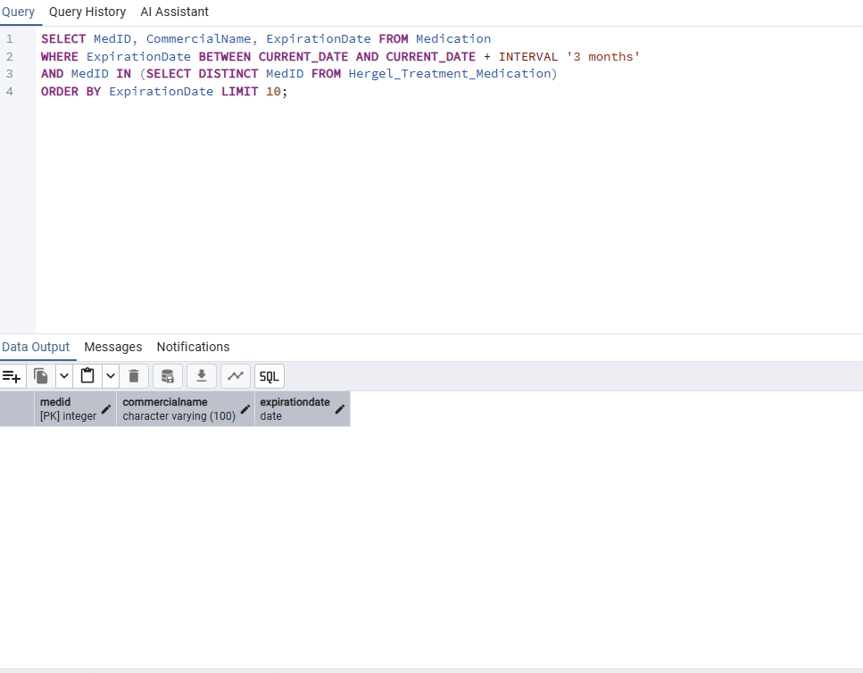
> *Caption: UPDATE 3 – Medications expiring within 3 months and in active use, BEFORE update*

> 🖼️ 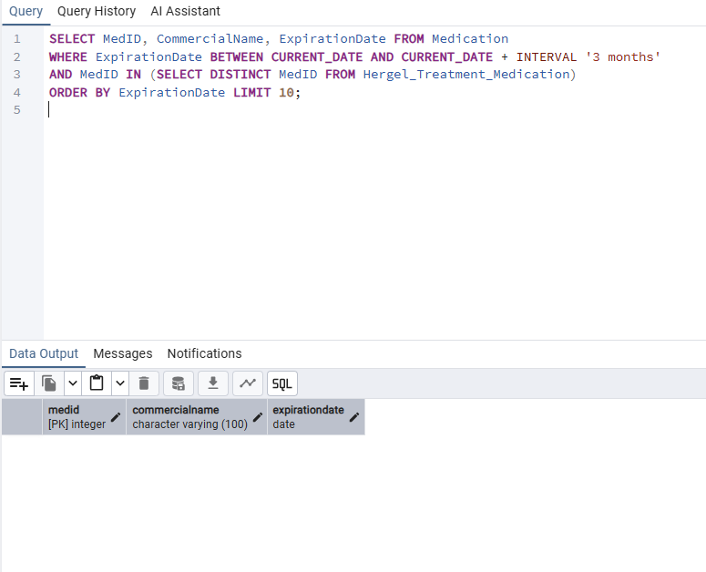
> *Caption: UPDATE 3 – Same medications after the 6-month extension*

---

## 6. Constraints (ALTER TABLE)

> File: `Constraints.sql`

---

### 6.1 Constraint 1 – CHECK: Realistic weight range for animals

**Description:** Add a constraint verifying that an animal's weight is between **0.01 kg and 999.99 kg**. The original constraint only ensured `Weight > 0`. The upper bound is set to 999.99 because the column type is `NUMERIC(5,2)`, which can store at most 3 digits before the decimal point.
**תיאור:** הוסף אילוץ (constraint) המוודא שמשקל חיה נמצא בין **0.01 ק"ג ל-999.99 ק"ג**. האילוץ המקורי הבטיח רק `Weight > 0`. הגבול העליון נקבע ל-999.99 מכיוון שסוג העמודה הוא `NUMERIC(5,2)`, שיכולה לאחסן לכל היותר 3 ספרות לפני הנקודה העשרונית.

> ⚠️ **Important technical note:** Using `Weight = 15000` as a test would trigger a *numeric type overflow* error (`NUMERIC(5,2)` maxes at 999.99) **before** PostgreSQL even evaluates the CHECK constraint. To cleanly demonstrate the constraint, we use `Weight = 0`, which fits the type but violates the lower bound `0.01`.

```sql
ALTER TABLE Animal
ADD CONSTRAINT chk_animal_weight_range
CHECK (Weight BETWEEN 0.01 AND 999.99);
```

**Failure test:**

```sql
INSERT INTO Animal (AnimalID, Name, Species, BirthDate, Gender, Weight)
VALUES (99901, 'TestZero', 'Cat', '2020-01-01', 'Male', 0);
-- ❌ ERROR: new row violates check constraint "chk_animal_weight_range"
```

#### 📊 Proof of Execution

> 🖼️ 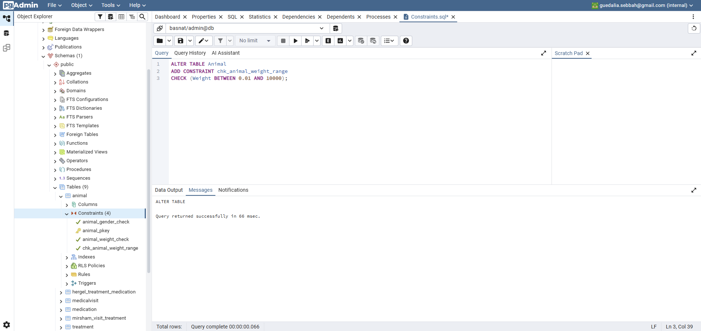
> *Caption: Constraint 1 – ALTER TABLE executes successfully*

> 🖼️ 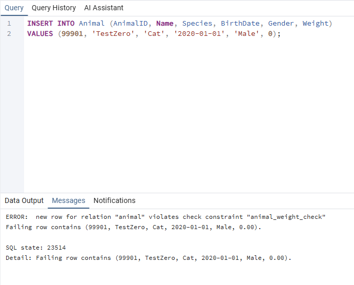
> *Caption: Constraint 1 – INSERT with weight=15000 is correctly rejected*

---

### 6.2 Constraint 2 – CHECK: Visit date must not be in the future

**Description:** Prevent recording a medical visit for a date that has not yet occurred. A visit must have taken place in the past or today.
**תיאור:** מנע רישום של ביקור רפואי לתאריך שטרם התרחש. ביקור חייב להתבצע בעבר או היום.

```sql
ALTER TABLE MedicalVisit
ADD CONSTRAINT chk_visit_not_future
CHECK (VisitDate <= CURRENT_DATE);
```

**Failure test:**

```sql
INSERT INTO MedicalVisit (VisitID, VisitDate, Reason, Summary, Cost, AnimalID, VetID)
VALUES (99901, '2030-12-31', 'Future checkup', 'Impossible', 100.00, 1, 1);
-- ❌ ERROR: new row violates check constraint "chk_visit_not_future"
```

#### 📊 Proof of Execution

> 🖼️ 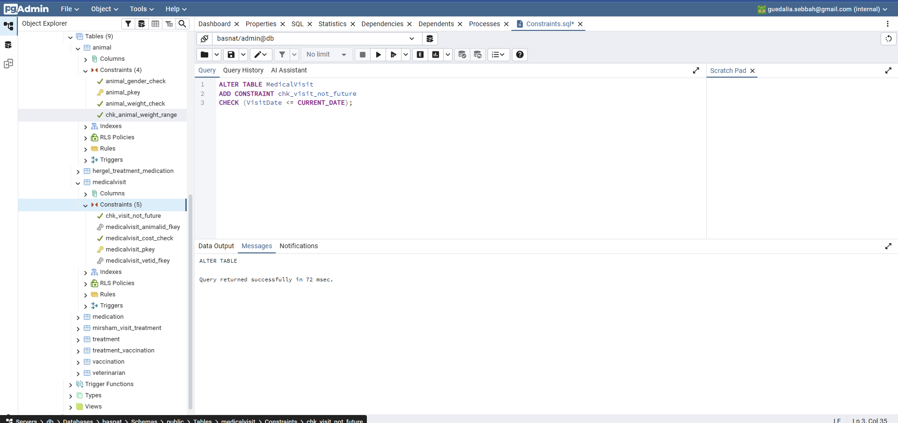
> *Caption: Constraint 2 – ALTER TABLE executes successfully*

> 🖼️ 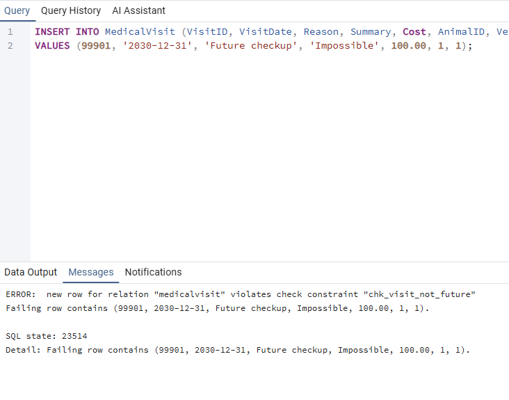
> *Caption: Constraint 2 – INSERT with a future date is correctly rejected*

---

### 6.3 Constraint 3 – UNIQUE: One visit per animal/vet/day

**Description:** Guarantee that the same veterinarian cannot have two visits for the same animal on the same day. This prevents accidental duplicate record entry.
**תיאור:** הבטח שאותו וטרינר לא יוכל לבצע שני ביקורים עבור אותה חיה באותו יום. פעולה זו מונעת הזנה בטעות של רשומות כפולות.

```sql
ALTER TABLE MedicalVisit
ADD CONSTRAINT uq_one_visit_per_animal_per_vet_per_day
UNIQUE (AnimalID, VetID, VisitDate);
```

**Failure test:**

```sql
-- Step 1: Valid insert (should succeed)
INSERT INTO MedicalVisit (VisitID, VisitDate, Reason, Summary, Cost, AnimalID, VetID)
VALUES (99902, '2024-06-15', 'Routine checkup', 'All good', 75.00, 1, 1);

-- Step 2: Duplicate attempt (same animal, same vet, same date) → MUST FAIL
INSERT INTO MedicalVisit (VisitID, VisitDate, Reason, Summary, Cost, AnimalID, VetID)
VALUES (99903, '2024-06-15', 'Another checkup', 'Duplicate', 80.00, 1, 1);
-- ❌ ERROR: duplicate key value violates unique constraint
```

#### 📊 Proof of Execution

> 🖼️ 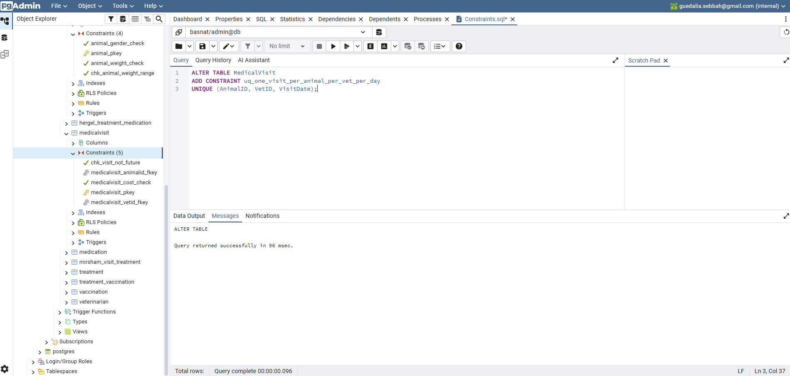
> *Caption: Constraint 3 – ALTER TABLE + valid INSERT both succeed*

> 🖼️ 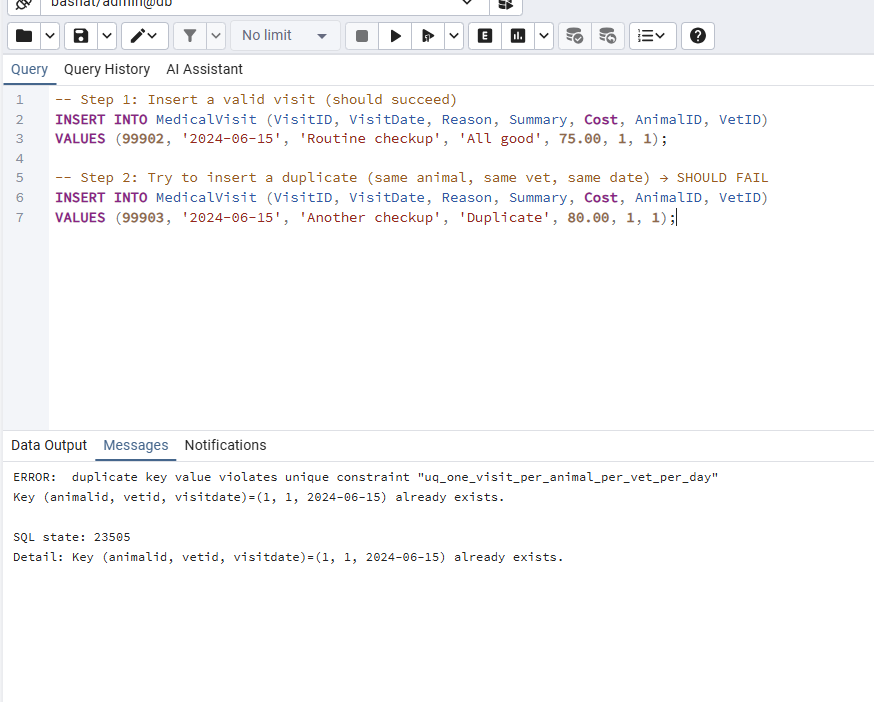
> *Caption: Constraint 3 – Duplicate INSERT is correctly rejected*

---

### 6.4 Constraint 4 (Bonus) – CHECK: Minimum medication expiration date

**Description:** Prevent inserting medications with an expiration date before 2020, which would clearly be a data entry error.
**תיאור:** מנע הכנסת תרופות עם תאריך תפוגה לפני שנת 2020, דבר שכמובן יהווה שגיאת הזנת נתונים.

```sql
ALTER TABLE Medication
ADD CONSTRAINT chk_medication_min_expiration
CHECK (ExpirationDate >= '2020-01-01');
```

**Failure test:**

```sql
INSERT INTO Medication (MedID, CommercialName, ActiveIngredient, DosageUnit, ExpirationDate)
VALUES (99901, 'OldMed', 'Expired_Ingredient', 'mg', '2015-06-01');
-- ❌ ERROR: new row violates check constraint "chk_medication_min_expiration"
```

#### 📊 Proof of Execution

> 🖼️ 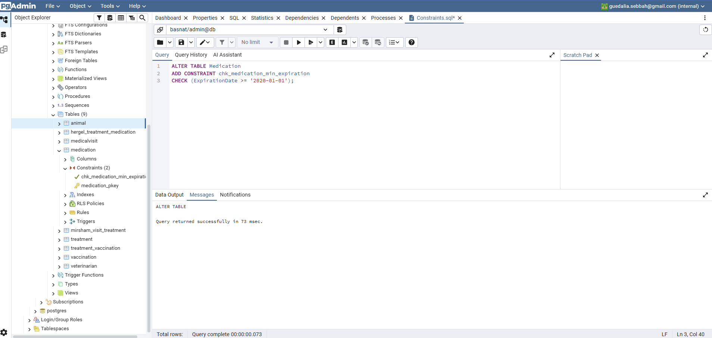
> *Caption: Constraint 4 – ALTER TABLE executes successfully*

> 🖼️ 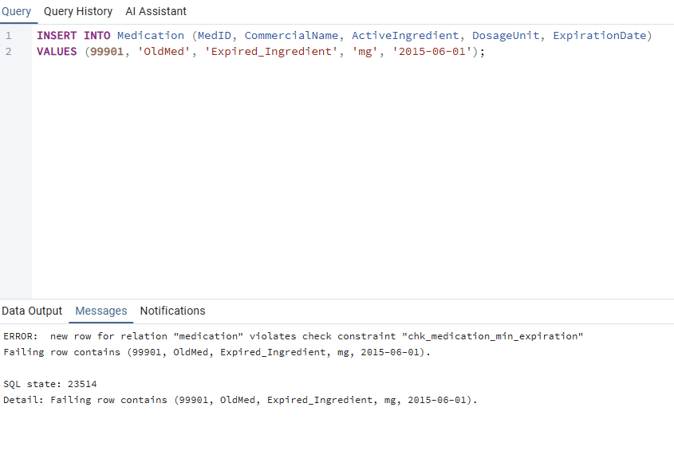
> *Caption: Constraint 4 – INSERT with date 2015 is correctly rejected*

---

## 7. Transactions (ROLLBACK & COMMIT)

> File: `RollbackCommit.sql`

---

### 7.1 Transaction 1: UPDATE + ROLLBACK

**Description:** This transaction attempts to **double the cost** of all medical visits in January 2024. A `ROLLBACK` is then executed to **undo** all modifications — the data returns to its original state.
**תיאור:** טרנזקציה זו מנסה **להכפיל את העלות** של כל הביקורים הרפואיים בינואר 2024. לאחר מכן מבוצע `ROLLBACK` כדי **לבטל** את כל השינויים — הנתונים חוזרים למצבם המקורי.

**Educational goal:** Demonstrate the **ATOMICITY** property of ACID transactions — either all operations succeed, or none of them take effect.

```sql
-- Step 1: Check data BEFORE
SELECT VisitID, VisitDate, Cost 
FROM MedicalVisit 
WHERE EXTRACT(MONTH FROM VisitDate) = 1 
  AND EXTRACT(YEAR FROM VisitDate) = 2024
ORDER BY VisitID LIMIT 10;

-- Step 2: Begin transaction
BEGIN;

-- Step 3: UPDATE (double the cost)
UPDATE MedicalVisit
SET Cost = Cost * 2
WHERE EXTRACT(MONTH FROM VisitDate) = 1 
  AND EXTRACT(YEAR FROM VisitDate) = 2024;

-- Step 4: Check data DURING transaction (costs should be doubled)
SELECT VisitID, VisitDate, Cost 
FROM MedicalVisit 
WHERE EXTRACT(MONTH FROM VisitDate) = 1 
  AND EXTRACT(YEAR FROM VisitDate) = 2024
ORDER BY VisitID LIMIT 10;

-- Step 5: ROLLBACK
ROLLBACK;

-- Step 6: Check data AFTER ROLLBACK (back to original)
SELECT VisitID, VisitDate, Cost 
FROM MedicalVisit 
WHERE EXTRACT(MONTH FROM VisitDate) = 1 
  AND EXTRACT(YEAR FROM VisitDate) = 2024
ORDER BY VisitID LIMIT 10;
```

#### 📊 Execution Results

> 🖼️ 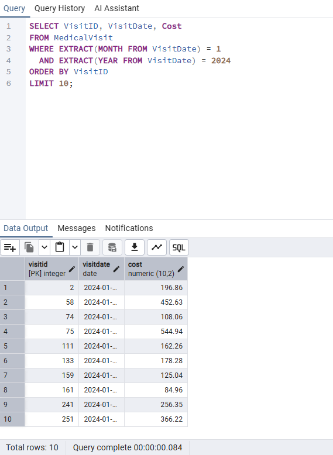
> *Caption: Transaction 1 – Original costs BEFORE the transaction*

> 🖼️ 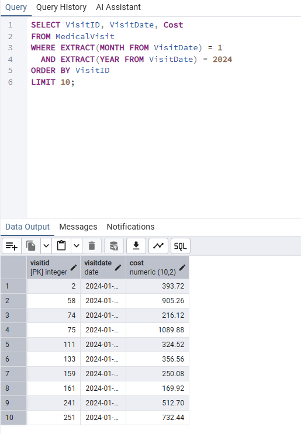
> *Caption: Transaction 1 – Costs are doubled DURING the transaction (not yet committed)*

> 🖼️ 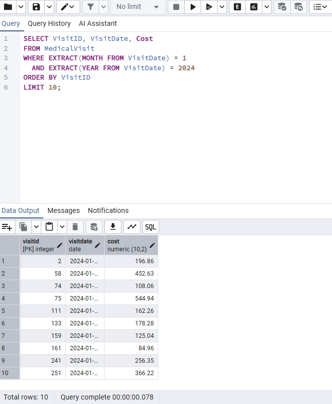
> *Caption: Transaction 1 – Costs are back to original AFTER the ROLLBACK*

---

### 7.2 Transaction 2: UPDATE + COMMIT

**Description:** This transaction applies a **10% discount** on visits costing more than 400 in February 2024. The `COMMIT` makes the modifications **permanent**.
**תיאור:** טרנזקציה זו מחילה **הנחה של 10%** על ביקורים בעלות של יותר מ-400 בפברואר 2024. ה-`COMMIT` הופך את השינויים ל**קבועים**.

**Educational goal:** Demonstrate the **DURABILITY** and **CONSISTENCY** properties of ACID — once committed, changes survive any system failure.

```sql
-- Step 1: Check data BEFORE
SELECT VisitID, VisitDate, Cost 
FROM MedicalVisit 
WHERE EXTRACT(MONTH FROM VisitDate) = 2 
  AND EXTRACT(YEAR FROM VisitDate) = 2024
  AND Cost > 400
ORDER BY VisitID LIMIT 10;

-- Step 2: Begin transaction
BEGIN;

-- Step 3: UPDATE (apply 10% discount)
UPDATE MedicalVisit
SET Cost = ROUND(Cost * 0.90, 2)
WHERE EXTRACT(MONTH FROM VisitDate) = 2 
  AND EXTRACT(YEAR FROM VisitDate) = 2024
  AND Cost > 400;

-- Step 4: Check data DURING transaction (costs reduced by 10%)
SELECT VisitID, VisitDate, Cost 
FROM MedicalVisit 
WHERE EXTRACT(MONTH FROM VisitDate) = 2 
  AND EXTRACT(YEAR FROM VisitDate) = 2024
  AND Cost > 360
ORDER BY VisitID LIMIT 10;

-- Step 5: COMMIT
COMMIT;

-- Step 6: Check data AFTER COMMIT (changes are permanent)
SELECT VisitID, VisitDate, Cost 
FROM MedicalVisit 
WHERE EXTRACT(MONTH FROM VisitDate) = 2 
  AND EXTRACT(YEAR FROM VisitDate) = 2024
  AND Cost > 360
ORDER BY VisitID LIMIT 10;
```

#### Key Difference: ROLLBACK vs COMMIT

| Aspect | ROLLBACK | COMMIT |
|--------|----------|--------|
| **Effect** | Cancels ALL modifications | Makes ALL modifications permanent |
| **Data after** | Returns to initial state | New state saved definitively |
| **ACID property** | Atomicity (all or nothing) | Durability (survives crashes) |
| **Use case** | Error detected, wrong calculation | Operation validated and verified |

#### 📊 Execution Results

> 🖼️ 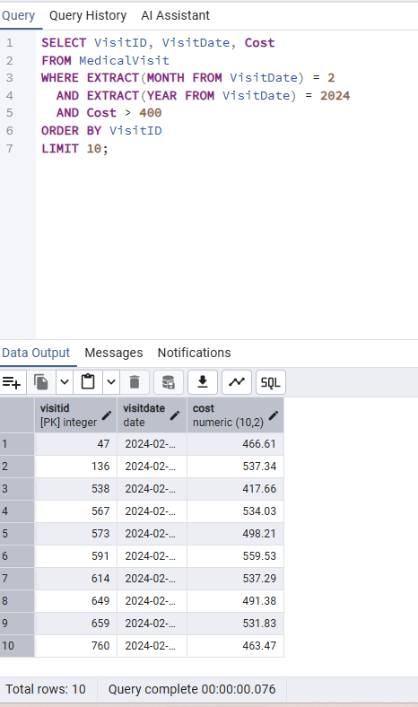
> *Caption: Transaction 2 – Original costs BEFORE the transaction*

> 🖼️ 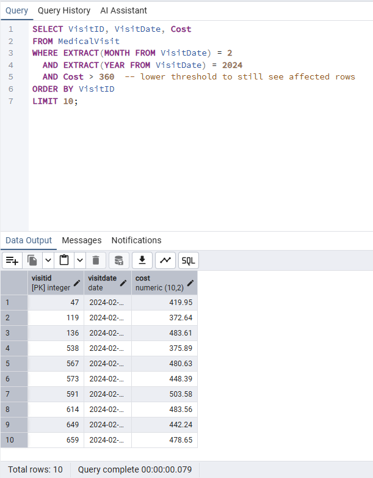
> *Caption: Transaction 2 – Costs reduced by 10% DURING the transaction*

> 🖼️ 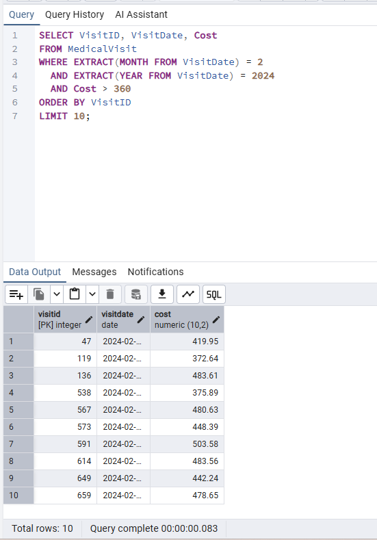
> *Caption: Transaction 2 – Reduced costs are permanent AFTER the COMMIT*
