# 🏗️ Phase 3: Integration & Views — VetCare + HR System

**Team Members:** Avinoam Muller 347465932, Guedalia Sebbah 337966659  
**System Name:** VetCare Management System  
**Original Module:** Clinic & Medical Administration (Veterinary Department)  
**Received Module:** Employee & Shift Management (HR Department — from Eitan's team)

---

## 📌 Table of Contents
1. [Overview of Both Systems](#1-overview-of-both-systems)
2. [DSD of the Received System (HR)](#2-dsd-of-the-received-system-hr)
3. [Reverse Engineering Algorithm](#3-reverse-engineering-algorithm)
4. [ERD of the Received System (HR)](#4-erd-of-the-received-system-hr)
5. [Integration Decisions](#5-integration-decisions)
6. [Combined ERD](#6-combined-erd)
7. [DSD After Integration](#7-dsd-after-integration)
8. [Integration Commands Explanation](#8-integration-commands-explanation)
9. [Views and Queries](#9-views-and-queries)

---

## 1. Overview of Both Systems

### Our Original System — VetCare (Veterinary Department)

| Table | Description | Key |
|-------|-------------|-----|
| `Animal` | Zoo animals with species, birth date, gender, weight | PK: AnimalID |
| `Veterinarian` | Vets with license, specialization, hire date | PK: VetID |
| `MedicalVisit` | Medical visits linking animal to vet | PK: VisitID, FK: AnimalID, VetID |
| `Treatment` | Available treatments with severity levels | PK: TreatmentID |
| `Medication` | Medications with active ingredients & dosage | PK: MedID |
| `Vaccination` | Vaccinations with manufacturer & storage info | PK: VacID |
| `Mirsham_Visit_Treatment` | Junction: Visit ↔ Treatment (M:N) | PK: (VisitID, TreatmentID) |
| `Hergel_Treatment_Medication` | Junction: Treatment ↔ Medication (M:N) | PK: (TreatmentID, MedID) |
| `Treatment_Vaccination` | Junction: Treatment ↔ Vaccination (M:N) | PK: (TreatmentID, VacID) |

### Received System — HR (Human Resources Department)

| Table | Description | Key |
|-------|-------------|-----|
| `Department` | Organization departments with location | PK: department_id |
| `Role` | Employee roles/titles | PK: role_id |
| `Employee_Contract` | Contracts with salary (min 5000) and start date | PK: contract_id |
| `Employee` | Employees with personal info | PK: employee_id, FK: department_id, role_id, contract_id |
| `Office` | Physical offices linked to departments | PK: office_id, FK: department_id |
| `Shift` | Shift types with start times | PK: shift_id |
| `Shift_Assignment` | Shift assignments (Employee ↔ Shift, M:N) | PK: assignment_id, FK: employee_id, shift_id |

---

## 2. DSD of the Received System (HR)

The DSD (Data Structure Diagram / Relational Schema) was built by analyzing the tables in `backup_eitan_friend.sql`.

> 📸 **Screenshot: DSD of the HR system (ERDPlus)**
> 🖼️ 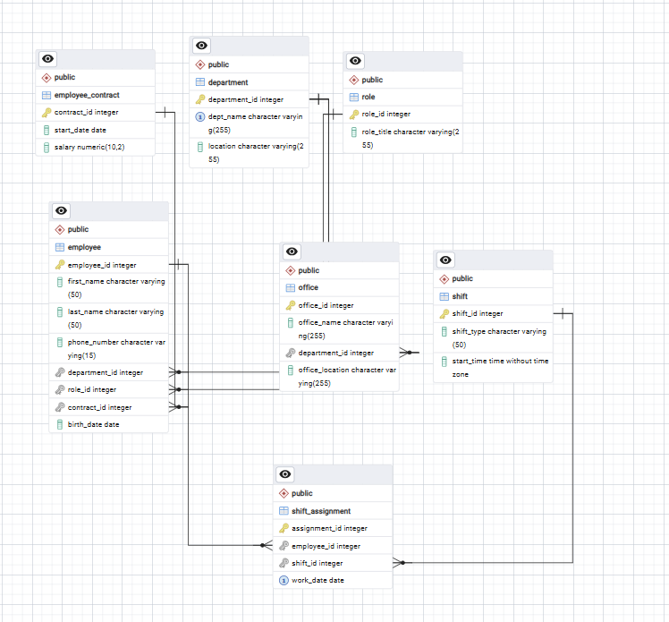
> *Caption: DSD of the HR system (ERDPlus)*

---

## 3. Reverse Engineering Algorithm

### Algorithm: From Schema (DSD) to ERD

**Input:** A set of relational tables with columns, primary keys, and foreign keys.  
**Output:** An Entity-Relationship Diagram (ERD).

**Steps:**

1. **Identify entities from independent tables:**
   - Tables with NO foreign keys are strong entities.
   - Found: `Department`, `Role`, `Shift`

2. **Identify entities from dependent tables:**
   - Tables with FKs but their own PK (not composite) are weak/dependent entities.
   - Found: `Employee_Contract` (independent but linked via FK from Employee), `Employee` (dependent on Department, Role, Contract), `Office` (dependent on Department)

3. **Identify M:N relationships from junction tables:**
   - Tables with a composite PK made of two FKs, or tables whose primary purpose is to connect two entities.
   - Found: `Shift_Assignment` — connects `Employee` and `Shift` (M:N relationship)
   - Note: Although `Shift_Assignment` has its own `assignment_id` PK, it has a UNIQUE constraint on `(employee_id, shift_id, work_date)` and its sole purpose is to assign employees to shifts, making it a junction table.

4. **Determine cardinalities for each FK relationship:**
   - `Department` 1 → N `Employee`: One department has many employees
   - `Role` 1 → N `Employee`: One role can be held by many employees
   - `Employee_Contract` 1 → 1 `Employee`: Each contract belongs to one employee
   - `Department` 1 → N `Office`: One department has many offices
   - `Employee` N ↔ M `Shift` (via `Shift_Assignment`): Many-to-many with `work_date` attribute

5. **Create the ERD:**
   - Draw each entity as a rectangle
   - Draw each relationship as a diamond
   - Add attributes to entities
   - Mark cardinalities on relationship lines
   - Mark PKs as underlined, FKs with arrows

---

## 4. ERD of the Received System (HR)

The ERD was created in ERDPlus based on the reverse engineering algorithm above.

**Entities:** Department, Role, Employee_Contract, Employee, Office, Shift

**Relationships:**
- **Works_In:** Employee → Department (N:1)
- **Has_Role:** Employee → Role (N:1)
- **Has_Contract:** Employee → Employee_Contract (1:1)
- **Located_In:** Office → Department (N:1)
- **Assigned_Shift:** Employee ↔ Shift (M:N via Shift_Assignment, with attribute `work_date`)

> 📸 **Screenshot: ERD of the HR system (ERDPlus)**
> 🖼️ 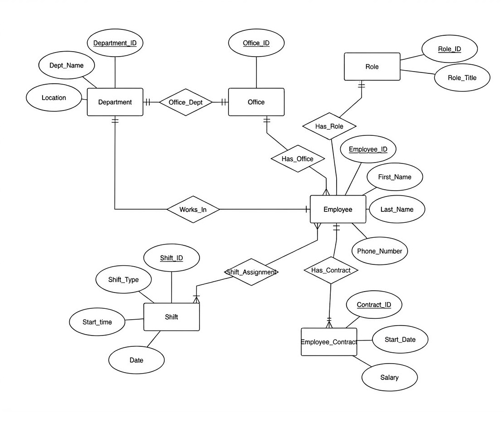
> *Caption: ERD of the HR system (ERDPlus)*

---

## 5. Integration Decisions

### Decision 1: Connection Point
**Decision:** Veterinarians are employees of the organization.  
**Reasoning:** In a real-world zoo/veterinary organization, vets are staff members. The HR system manages all employees, and vets are a specialized subset.  
**Implementation:** Add `employee_id` FK to the `Veterinarian` table.

### Decision 2: No Table Merging
**Decision:** We keep `Veterinarian` and `Employee` as separate tables.  
**Reasoning:** `Veterinarian` has specialized fields (`LicenseNumber`, `Specialization`) that don't belong in a general `Employee` table. Merging would violate normalization.

### Decision 3: No Duplication of Personal Info
**Decision:** Name information stays in both tables (VetCare uses `FirstName/LastName` in Veterinarian, HR uses `first_name/last_name` in Employee).  
**Reasoning:** Since the two systems were developed independently, we maintain backward compatibility. The link via `employee_id` allows joining when needed.

### Decision 4: Cascade Behavior
**Decision:** `ON DELETE SET NULL, ON UPDATE CASCADE` for the FK.  
**Reasoning:** If an employee is deleted from HR, the vet record should remain but lose the link. If an employee_id changes, it should propagate.

### Decision 5: Selective Linking
**Decision:** Not all vets must be linked to an employee immediately.  
**Reasoning:** The `employee_id` column allows NULL, enabling gradual integration.

---

## 6. Combined ERD

The combined ERD shows all entities from BOTH systems connected through the `employee_id` link in the `Veterinarian` table.

> 📸 **Screenshot: Combined ERD (ERDPlus)**
> 🖼️ 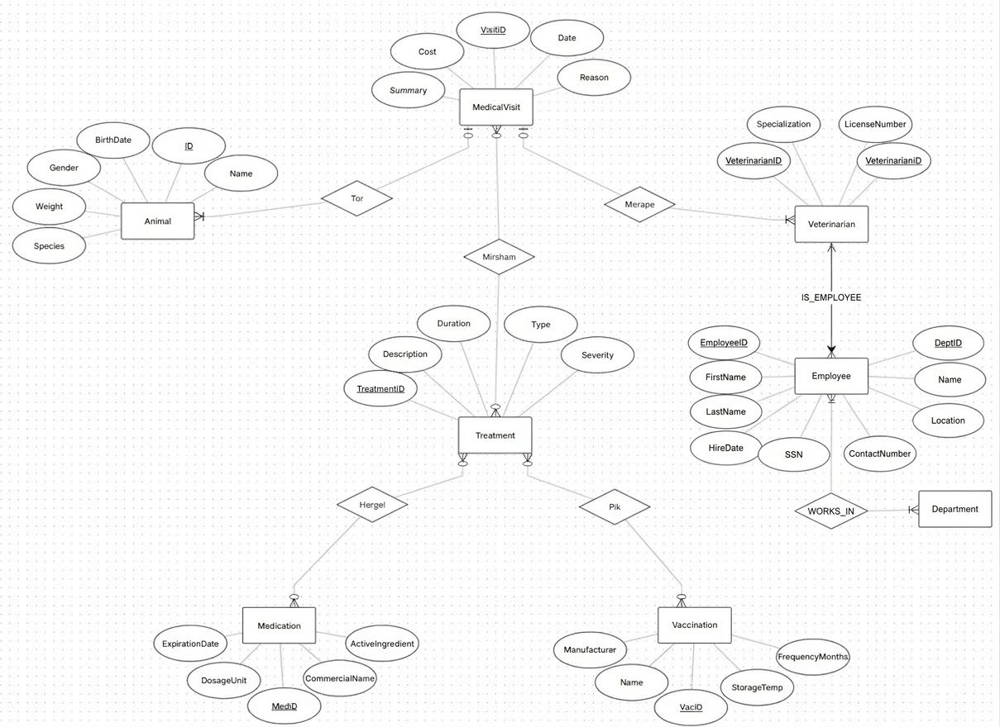
> *Caption: Combined ERD (ERDPlus)*

---

## 7. DSD After Integration

The final DSD shows all 16 tables (9 from VetCare + 7 from HR) with the added `employee_id` column in `Veterinarian`.

Modified table structure for `Veterinarian`:
```
Veterinarian (
    VetID          INT  PK,
    FirstName      VARCHAR(100),
    LastName       VARCHAR(100),
    LicenseNumber  VARCHAR(50) UNIQUE,
    Specialization VARCHAR(100),
    HireDate       DATE,
    employee_id    INT  FK → Employee(employee_id)   ← NEW
)
```

> 📸 **Screenshot: Final DSD after integration (ERDPlus)**
> 🖼️ 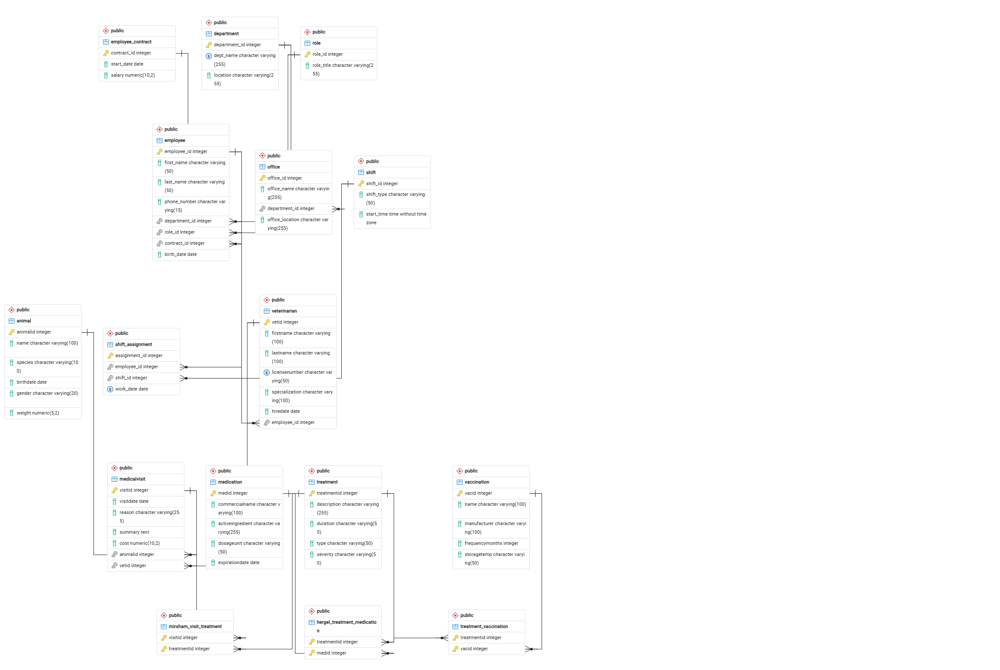
> *Caption: Final DSD after integration (ERDPlus)*

---

## 8. Integration Commands Explanation

### Part A: Creating HR Tables
The `Integrate.sql` file creates the 7 tables from the HR system using `CREATE TABLE IF NOT EXISTS`. This ensures we don't overwrite any existing tables.

Tables created in this order (respecting FK dependencies):
1. `Department` — no dependencies
2. `Role` — no dependencies
3. `Employee_Contract` — no dependencies
4. `Employee` — depends on Department, Role, Employee_Contract
5. `Office` — depends on Department
6. `Shift` — no dependencies
7. `Shift_Assignment` — depends on Employee, Shift

### Part B: Connecting the Systems
Two `ALTER TABLE` commands modify the existing `Veterinarian` table:
1. `ALTER TABLE Veterinarian ADD COLUMN employee_id INTEGER;` — Adds the new column
2. `ALTER TABLE Veterinarian ADD CONSTRAINT fk_vet_employee FOREIGN KEY (employee_id) REFERENCES Employee(employee_id);` — Adds the FK

### Part C: Sample Data Linking
`UPDATE` statements link the first 10 veterinarians to employee records, demonstrating the integration.

### Verification Screenshots

> 📸 **Screenshot 5: All tables visible in pgAdmin (VetCare + HR)**  
> 🖼️ 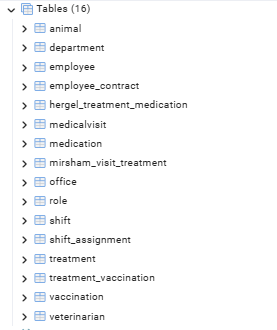  
> *Caption: All integrated tables listed in pgAdmin*

> 📸 **Screenshot 6: Result of the COUNT(*) query for all tables**  
> 🖼️ 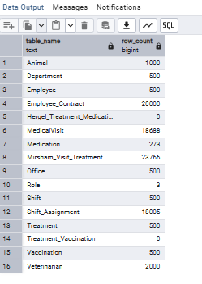  
> *Caption: Validation query showing row counts for each table*

---

## 9. Views and Queries

### View 1: `vet_visit_summary` — VetCare Department Perspective

**Description:** This view provides a comprehensive overview of medical visits in the veterinary department. It joins `MedicalVisit`, `Animal`, and `Veterinarian` tables to show the animal's name and species, the vet's full name and specialization, visit details, and a count of treatments applied during each visit.

```sql
CREATE OR REPLACE VIEW vet_visit_summary AS
SELECT
    mv.VisitID,
    a.Name              AS animal_name,
    a.Species           AS animal_species,
    a.Gender            AS animal_gender,
    v.FirstName || ' ' || v.LastName AS vet_full_name,
    v.Specialization    AS vet_specialization,
    mv.VisitDate,
    mv.Reason,
    mv.Cost,
    (SELECT COUNT(*) FROM Mirsham_Visit_Treatment mvt
     WHERE mvt.VisitID = mv.VisitID) AS treatment_count
FROM MedicalVisit mv
JOIN Animal a       ON mv.AnimalID = a.AnimalID
JOIN Veterinarian v ON mv.VetID = v.VetID;
```

> 📸 **Screenshot: `SELECT * FROM vet_visit_summary LIMIT 10;`**
> 🖼️ 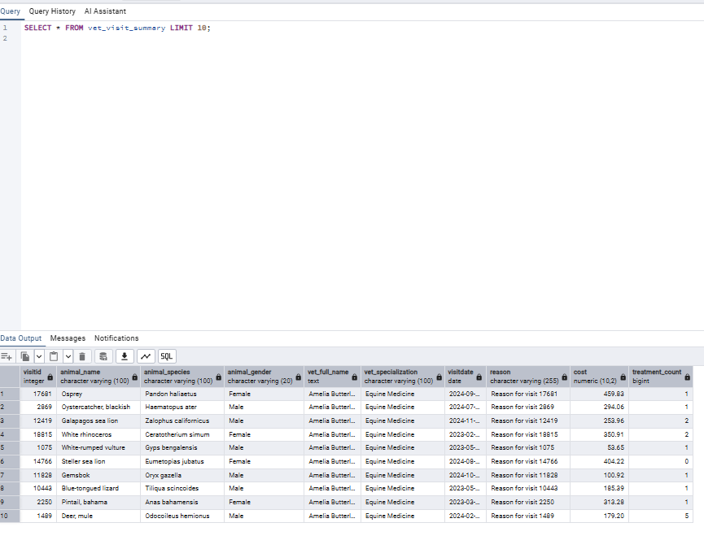
> *Caption: vet_visit_summary view*

#### Query 1.1: Top 5 Most Expensive Visits
**Description:** Retrieves the 5 most costly medical visits, showing which animal, vet, and reason were involved. Useful for financial analysis.

```sql
SELECT animal_name, animal_species, vet_full_name, vet_specialization,
       VisitDate, Reason, Cost, treatment_count
FROM vet_visit_summary
WHERE Cost IS NOT NULL
ORDER BY Cost DESC
LIMIT 5;
```

> 📸 **Screenshot: Query 1.1 result**
> 🖼️ 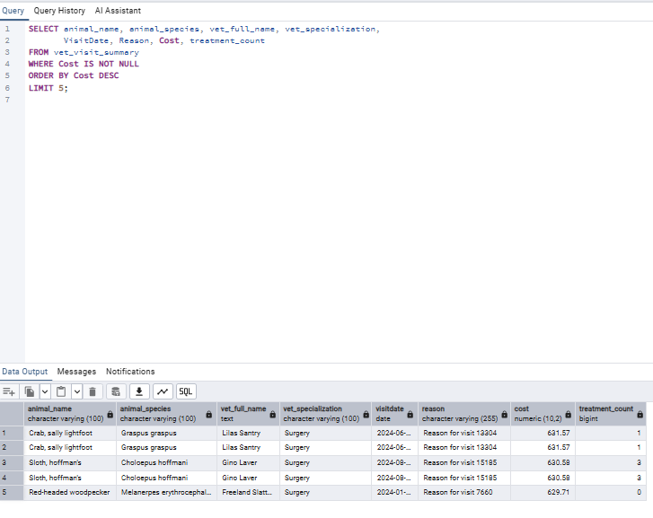
> *Caption: Query 1.1 result*

#### Query 1.2: Visits Per Species with Average Cost
**Description:** Groups visits by animal species, counting total visits and computing average, max, and min costs. Useful for resource planning.

```sql
SELECT animal_species, COUNT(*) AS total_visits,
       ROUND(AVG(Cost), 2) AS avg_cost, MAX(Cost) AS max_cost, MIN(Cost) AS min_cost
FROM vet_visit_summary
WHERE Cost IS NOT NULL
GROUP BY animal_species
ORDER BY total_visits DESC
LIMIT 10;
```

> 📸 **Screenshot: Query 1.2 result**
> 🖼️ 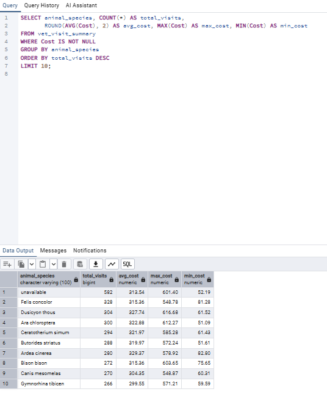
> *Caption: Query 1.2 result*

---

### View 2: `hr_employee_overview` — HR Department Perspective

**Description:** This view provides a full overview of employees from the HR system. It joins `Employee`, `Department`, `Role`, `Employee_Contract`, and `Office` to show each employee's full name, phone, department, role, salary, contract start date, and associated office.

```sql
CREATE OR REPLACE VIEW hr_employee_overview AS
SELECT
    e.employee_id,
    e.first_name || ' ' || e.last_name AS employee_full_name,
    e.phone_number, e.birth_date,
    d.dept_name AS department_name, d.location AS department_location,
    r.role_title, ec.salary, ec.start_date AS contract_start_date,
    o.office_name
FROM Employee e
JOIN Department d           ON e.department_id = d.department_id
JOIN Role r                 ON e.role_id = r.role_id
LEFT JOIN Employee_Contract ec ON e.contract_id = ec.contract_id
LEFT JOIN Office o          ON e.department_id = o.department_id;
```

> 📸 **Screenshot: `SELECT * FROM hr_employee_overview LIMIT 10;`**
> 🖼️ 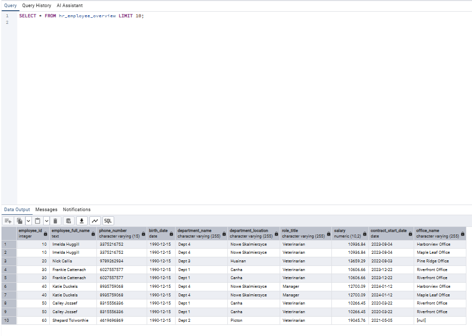
> *Caption: hr_employee_overview view*

#### Query 2.1: Top 10 Highest-Paid Employees
**Description:** Shows the 10 employees with the highest salary, along with their department, role, and office. Useful for salary auditing.

```sql
SELECT employee_full_name, department_name, role_title, salary,
       contract_start_date, office_name
FROM hr_employee_overview
WHERE salary IS NOT NULL
ORDER BY salary DESC
LIMIT 10;
```

> 📸 **Screenshot: Query 2.1 result**
> 🖼️ 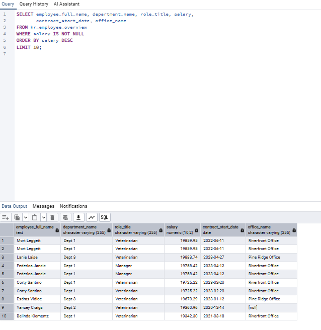
> *Caption: Query 2.1 result*

#### Query 2.2: Department Summary — Employee Count & Average Salary
**Description:** Groups employees by department and calculates the number of employees and average salary per department. Useful for HR planning.

```sql
SELECT department_name, COUNT(DISTINCT employee_id) AS num_employees,
       ROUND(AVG(salary), 2) AS avg_salary, MAX(salary) AS max_salary
FROM hr_employee_overview
WHERE salary IS NOT NULL
GROUP BY department_name
ORDER BY num_employees DESC
LIMIT 10;
```

> 📸 **Screenshot: Query 2.2 result**
> 🖼️ 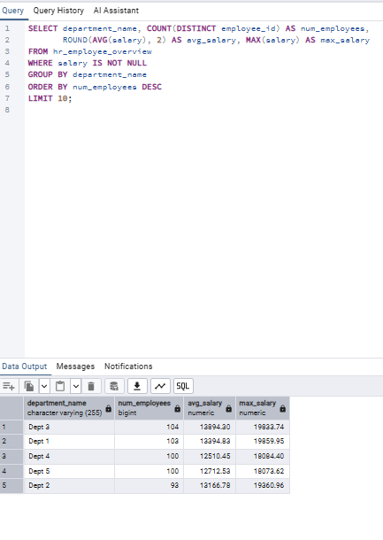
> *Caption: Query 2.2 result*

---

### View 3: `vet_staff_integrated_view` — Integrated View (Both Systems)

**Description:** This view demonstrates the integration by showing veterinarians alongside their employee data from the HR system. It joins `Veterinarian` with `Employee`, `Department`, `Role`, and `Employee_Contract` through the newly added `employee_id` FK. It also counts each vet's total medical visits.

```sql
CREATE OR REPLACE VIEW vet_staff_integrated_view AS
SELECT
    v.VetID, v.FirstName AS vet_first_name, v.LastName AS vet_last_name,
    v.LicenseNumber, v.Specialization, v.HireDate AS vet_hire_date,
    e.employee_id, e.phone_number AS employee_phone,
    d.dept_name AS hr_department, r.role_title AS hr_role,
    ec.salary AS employee_salary, ec.start_date AS contract_start,
    (SELECT COUNT(*) FROM MedicalVisit mv WHERE mv.VetID = v.VetID) AS total_visits
FROM Veterinarian v
LEFT JOIN Employee e            ON v.employee_id = e.employee_id
LEFT JOIN Department d          ON e.department_id = d.department_id
LEFT JOIN Role r                ON e.role_id = r.role_id
LEFT JOIN Employee_Contract ec  ON e.contract_id = ec.contract_id;
```

> 📸 **Screenshot: `SELECT * FROM vet_staff_integrated_view LIMIT 10;`**
> 🖼️ 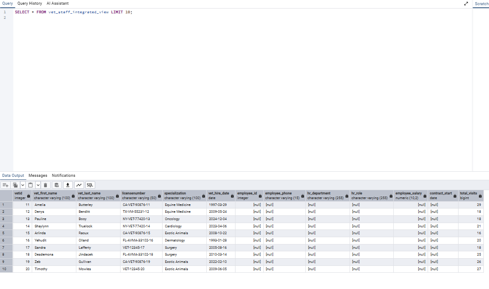
> *Caption: vet_staff_integrated_view view*

#### Query 3.1: Vet Productivity vs Salary
**Description:** Shows veterinarians that are linked to the HR system, with their salary and visit count. Useful for evaluating vet productivity vs compensation.

```sql
SELECT vet_first_name || ' ' || vet_last_name AS vet_name,
       Specialization, LicenseNumber, hr_department, hr_role,
       employee_salary, total_visits
FROM vet_staff_integrated_view
WHERE employee_id IS NOT NULL
ORDER BY total_visits DESC;
```

> 📸 **Screenshot: Query 3.1 result**
> 🖼️ 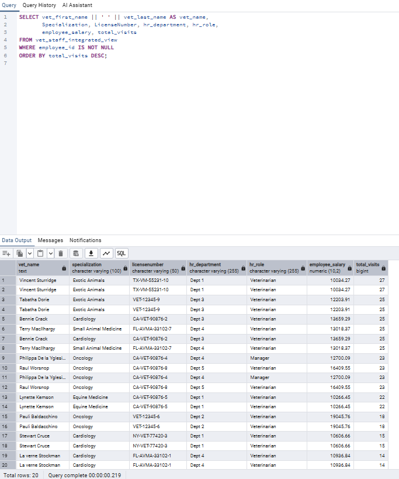
> *Caption: Query 3.1 result*

#### Query 3.2: All Vets — HR Link Status
**Description:** Shows all vets and whether they are linked to an HR employee record. Helps identify vets that still need integration.

```sql
SELECT vet_first_name || ' ' || vet_last_name AS vet_name,
       Specialization, vet_hire_date,
       CASE WHEN employee_id IS NOT NULL THEN 'Linked to HR'
            ELSE 'Not yet linked' END AS hr_status,
       COALESCE(employee_salary::TEXT, 'N/A') AS salary_info,
       COALESCE(hr_department, 'N/A') AS department_info,
       total_visits
FROM vet_staff_integrated_view
ORDER BY hr_status, vet_name;
```

> 📸 **Screenshot: Query 3.2 result**
> 🖼️ 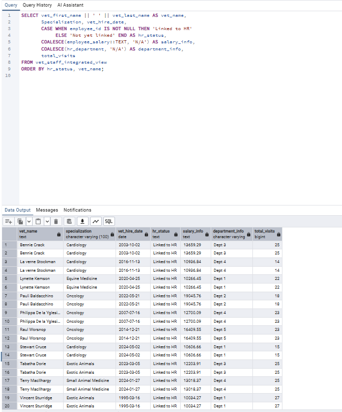
> *Caption: Query 3.2 result*

---

## 📋 Deliverables Checklist

| # | File | Status |
|---|------|--------|
| 1 | DSD of received HR system | ⬜ Screenshot needed |
| 2 | ERD of received HR system | ⬜ Screenshot needed |
| 3 | Combined ERD | ⬜ Screenshot needed |
| 4 | DSD after integration | ⬜ Screenshot needed |
| 5 | `Integrate.sql` | ✅ Created |
| 6 | `Views.sql` | ✅ Created |
| 7 | `backup3.backup` | ✅ Created via Docker |
| 8 | `README_SHLAV3.md` | ✅ This file |

---

## 🔧 Appendix: Docker Terminal Commands Used

Since the project uses pgAdmin inside a Docker container (where the PSQL Tool is disabled by default for security), SQL dumps containing `COPY ... FROM stdin;` commands were executed via the Docker CLI in PowerShell instead of the pgAdmin UI.

### 📥 1. Restoring the HR Backup (backup_eitan_friend.sql)
To correctly import Eitan's HR system (schema + data) into the `basnat` database, the following PowerShell command was used. It pipes the host's SQL file into the `psql` interface of the `PostgreSQL_DB` container.

```powershell
cmd /c "type .\Shlav3\backup_eitan_friend.sql | docker exec -i PostgreSQL_DB psql -U admin -d basnat"
```
*(We use `cmd /c type` as it performs raw text streaming better than `Get-Content` in PowerShell for large SQL files).*

### 📤 2. Generating the Final Backup (backup3.backup)
After running `Integrate.sql` and `Views.sql`, the final backup of the combined database is extracted directly from the container to the host machine using:

```powershell
cmd /c "docker exec -i PostgreSQL_DB pg_dump -U admin -d basnat > .\Shlav3\backup3.backup"
```
