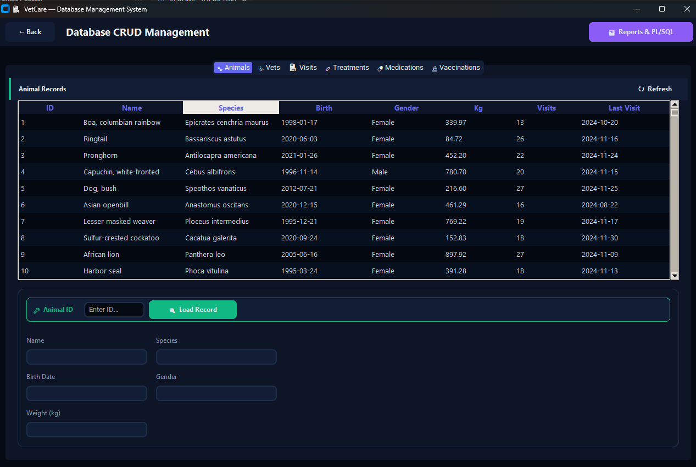
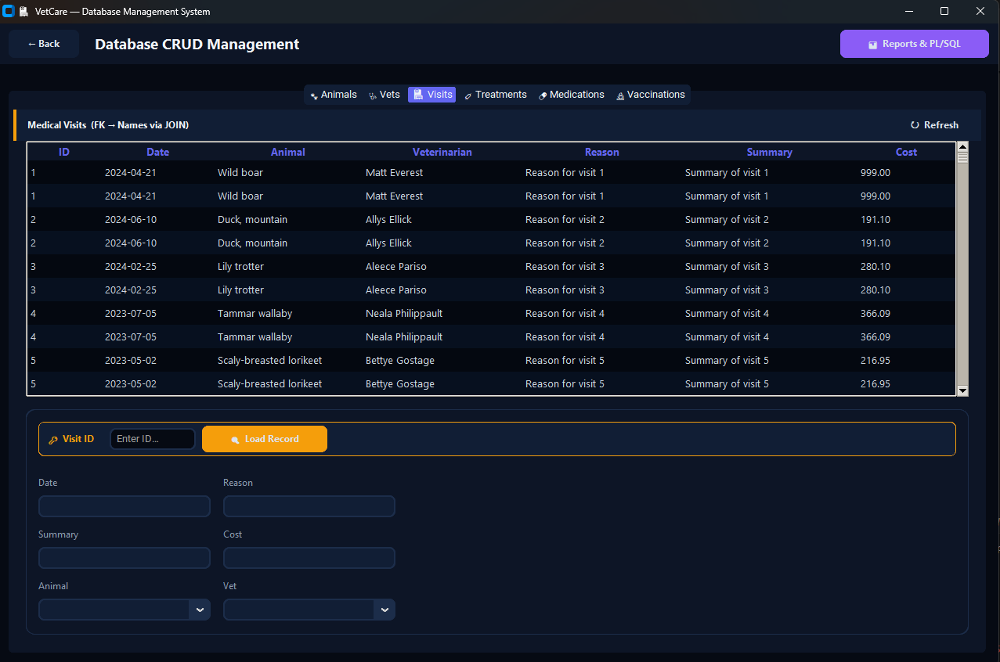
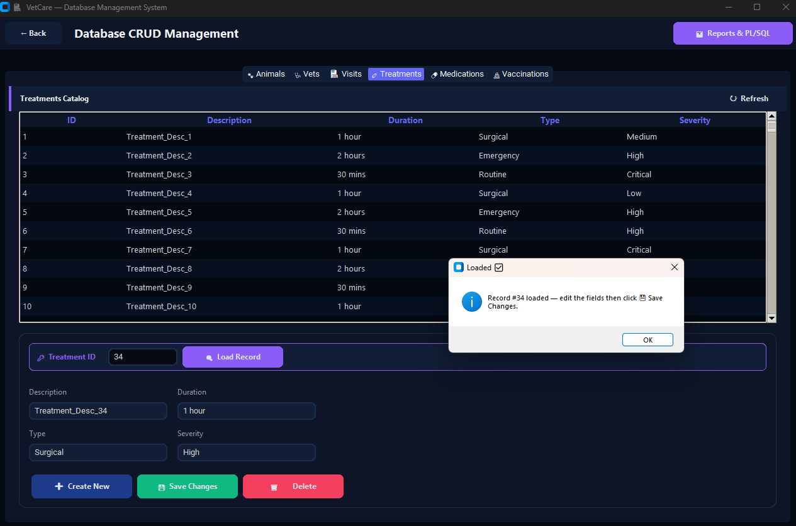
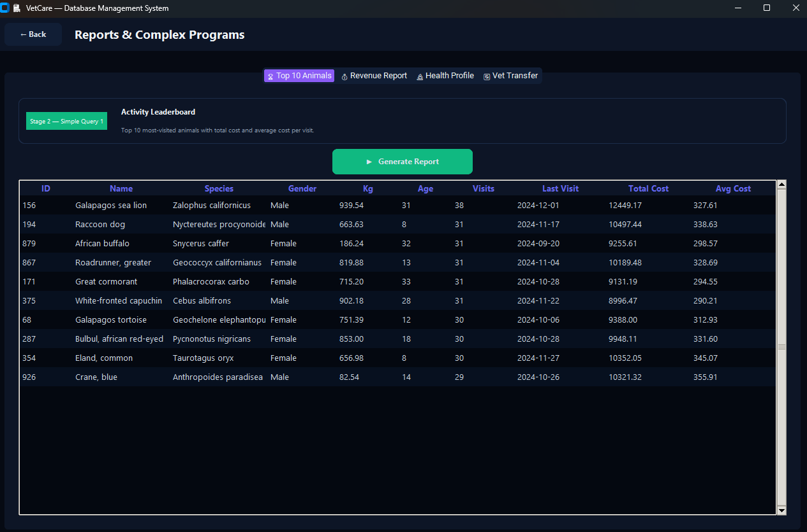
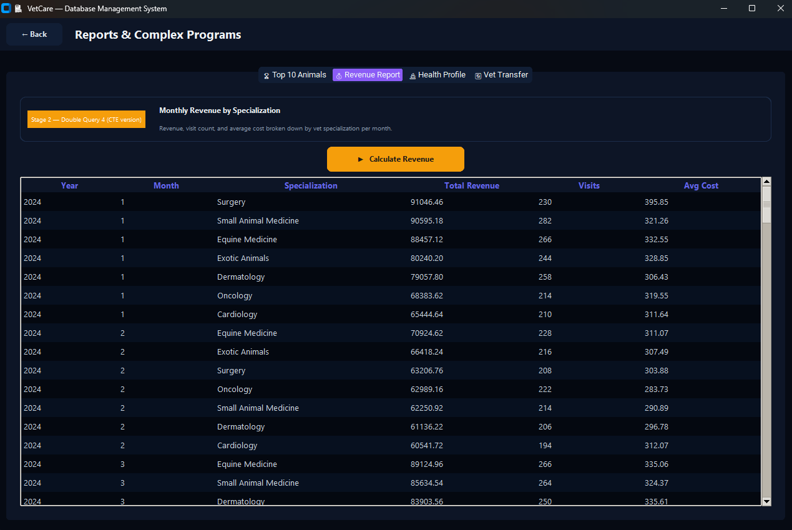
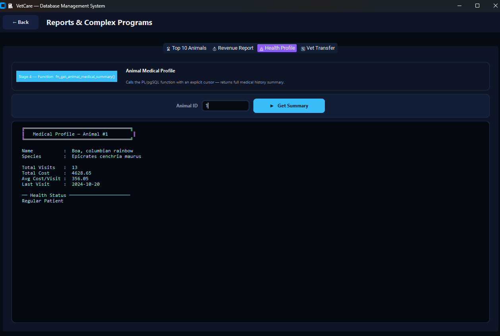
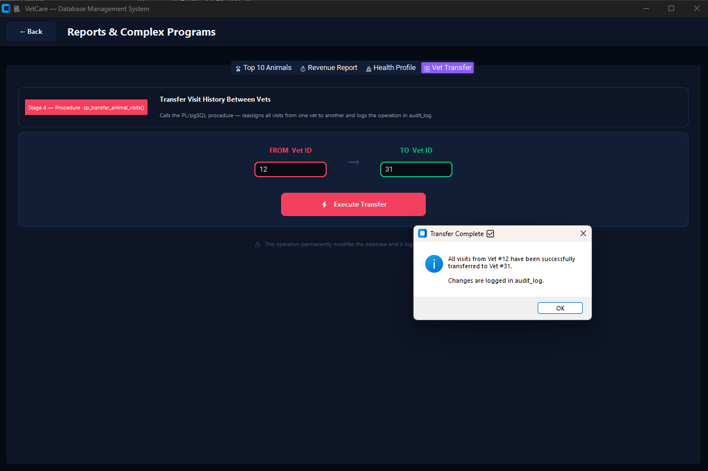

# 📋 Stage 5 — Python/Tkinter GUI for VetCare Management System

> **Course:** Databases Mini-Project  
> **Team:** Avinoam Muller (347465932) • Guedalia Sebbah (337966659)  
> **Stage:** 5 – Graphical User Interface (GUI)

---

## 🎯 Goal

Build a fully functional **desktop GUI** using Python + CustomTkinter connected to PostgreSQL that provides:
- **CRUD operations** on 6 core tables
- **Hidden foreign keys** — meaningful names via SQL JOINs, never raw IDs
- **Update-by-PK rule** — record must be fetched before editing
- **Advanced tab** — Stage 2 queries and Stage 4 PL/pgSQL routines at the click of a button

---

## 🛠️ Tech Stack

| Component | Tool | Purpose |
|-----------|------|---------|
| Language | **Python 3.10+** | Application logic |
| GUI Framework | **CustomTkinter 5.x** | Dark-mode desktop widgets |
| DB Connector | **psycopg2** | PostgreSQL communication |
| Environment | **python-dotenv** | Loads `.env` credentials |
| Database | **PostgreSQL 17.1** | Runs in Docker on port **5445** (mapped from container 5432) |

> **Important:** Port 8080 is pgAdmin (the web interface). The PostgreSQL database is exposed on **port 5445** on the host (Docker maps 5445 → 5432 inside the container).

### Architecture

```
┌──────────────────────┐     ┌──────────────┐     ┌─────────────────┐
│  app.py  (GUI)       │───► │  db.py       │───► │  PostgreSQL 17  │
│  CustomTkinter UI    │     │  psycopg2    │     │  localhost:5432 │
│  CRUD + Advanced     │     │  SQL queries │     │  DB: basnat     │
└──────────────────────┘     └──────────────┘     └─────────────────┘
```

---

## 🚀 Setup & Run

### 1. Start the database
```bash
docker-compose up -d
```

### 2. Install dependencies & launch
```bash
cd Shlav5
py -m pip install -r requirements.txt
py app.py
```

### 3. If connection fails
Click **⚙️ Connection Settings** on the welcome screen and enter:
- Host: `127.0.0.1`
- Port: `5445`
- Database: `basnat`
- User: `admin`
- Password: `password`

---

## 📸 Screenshots

### 1 — Welcome Screen

> 📸 **Screenshot: Welcome Screen**
> 🖼️ 
> *Caption: Welcome screen with navigation buttons and DB connection status indicator*

---

### 2 — Animals CRUD Tab

> 📸 **Screenshot: Animals CRUD Tab**
> 🖼️ 
> *Caption: Animals tab – Treeview listing all animals with TotalVisits and LastVisit columns*

---

### 3 — Medical Visits Tab (FK Hidden)

> 📸 **Screenshot: Medical Visits – Foreign Keys Hidden**
> 🖼️ 
> *Caption: Medical Visits tab — Animal Name and Vet Name displayed via JOINs instead of raw IDs; Animal and Vet selected by name via Combobox dropdowns*

---

### 4 — Update Rule: Fetch by ID

> 📸 **Screenshot: Fetch by ID in Action**
> 🖼️ 
> *Caption: Update flow — after entering the ID and clicking "🔍 Fetch by ID", all fields are auto-populated with the current record values*

---

### 5 — Top 10 Animals Query (Stage 2)

> 📸 **Screenshot: Top 10 Most Visited Animals**
> 🖼️ 
> *Caption: Advanced Reports — Stage 2 Simple Query 1 results showing the 10 most-visited animals with visit count, total cost, and average cost*

---

### 6 — Revenue Report Query (Stage 2)

> 📸 **Screenshot: Monthly Revenue Report**
> 🖼️ 
> *Caption: Advanced Reports — Stage 2 Double Query 4 (CTE version) — monthly revenue grouped by vet specialization*

---

### 7 — Animal Medical Summary Function (Stage 4)

> 📸 **Screenshot: Animal Medical Summary Function**
> 🖼️ 
> *Caption: Calling fn_get_animal_medical_summary() — result shows total visits, total cost, last visit date, and health status label*

---

### 8 — Transfer Visits Procedure (Stage 4)

> 📸 **Screenshot: Transfer Visits Procedure**
> 🖼️ 
> *Caption: Calling sp_transfer_animal_visits() — confirmation dialog followed by success result after transferring all visits between two vets*

---

## ✅ Requirements Checklist

| Requirement | Status | Implementation |
|------------|--------|---------------|
| CRUD on all VetCare core tables (6) | ✅ | Animals, Vets, Visits, Treatments, Medications, Vaccinations |
| CRUD on HR system tables (Stage 3) | ✅ | HR: Employees + HR: Departments tabs in `app.py` |
| UPDATE requires Fetch-by-PK first | ✅ | `_on_fetch()` sets `editing_pk`; `_on_update()` uses `editing_pk` (not raw field) |
| Foreign keys hidden — names via JOINs | ✅ | `fetch_visits()` JOINs Animal+Vet; Combobox dropdowns; Employee→Dept name |
| Input validation + error messages | ✅ | All CRUD actions validate numeric ID; all errors shown via `messagebox` |
| ≥ 2 Stage 2 SELECT queries | ✅ | Top 10 Animals (Simple Q1) + Monthly Revenue by Specialization (Double Q4 CTE) |
| ≥ 2 Stage 4 PL/pgSQL routines | ✅ | `fn_get_animal_medical_summary` (Function) + `sp_transfer_animal_visits` (Procedure) |
| Complete function result display | ✅ | Shows Name, Species, Total Visits, Total Cost, Avg Cost, Last Visit, Health Status |
| Clean UI with navigation | ✅ | Welcome → CRUD / Advanced (separate pages, Back button) |

---

## 📁 File Structure

```
Shlav5/
├── app.py               # GUI (CustomTkinter — 8 CRUD tabs + 4 Advanced tabs)
├── db.py                # Database layer (psycopg2 + SQL — all queries centralized)
├── requirements.txt     # Python dependencies
└── README_SHLAV5.md     # This file (setup, screenshots, checklist)
```

---

## 📷 Screenshot Guide — When and How to Take Each Screenshot

> Take all screenshots **after running `py app.py`** with the Docker DB running.

| # | Screenshot File | When to Take It |
|---|----------------|-----------------|
| 1 | `welcome_screen.png` | Immediately after launch — shows the green "Connected" status |
| 2 | `animals_crud_tab.png` | Click **📋 Data Management** → Animals tab loads with data |
| 3 | `visits_fk_hidden.png` | Click **🏥 Medical Visits** tab — Treeview shows Animal/Vet names |
| 4 | `fetch_by_id_update.png` | In any tab: type an ID into the ID field → click **🔍 Fetch by ID** → screenshot with fields populated |
| 5 | `query_top10_animals.png` | Click **📊 Advanced** → **🏆 Top 10 Animals** → click **▶ Run Query** |
| 6 | `query_revenue_report.png` | Click **💰 Revenue Report** → click **▶ Run Query** |
| 7 | `function_medical_summary.png` | Click **🔬 Animal Summary** → Type Animal ID (e.g. `1`) → click **▶ Execute Function** |
| 8 | `procedure_transfer_visits.png` | Click **🔄 Transfer Visits** → Enter two valid Vet IDs → click **▶ Execute Procedure** → screenshot the confirmation dialog or the success output |

**Save all screenshots to:**  `screenshoots/shlav5/` in the project root.
